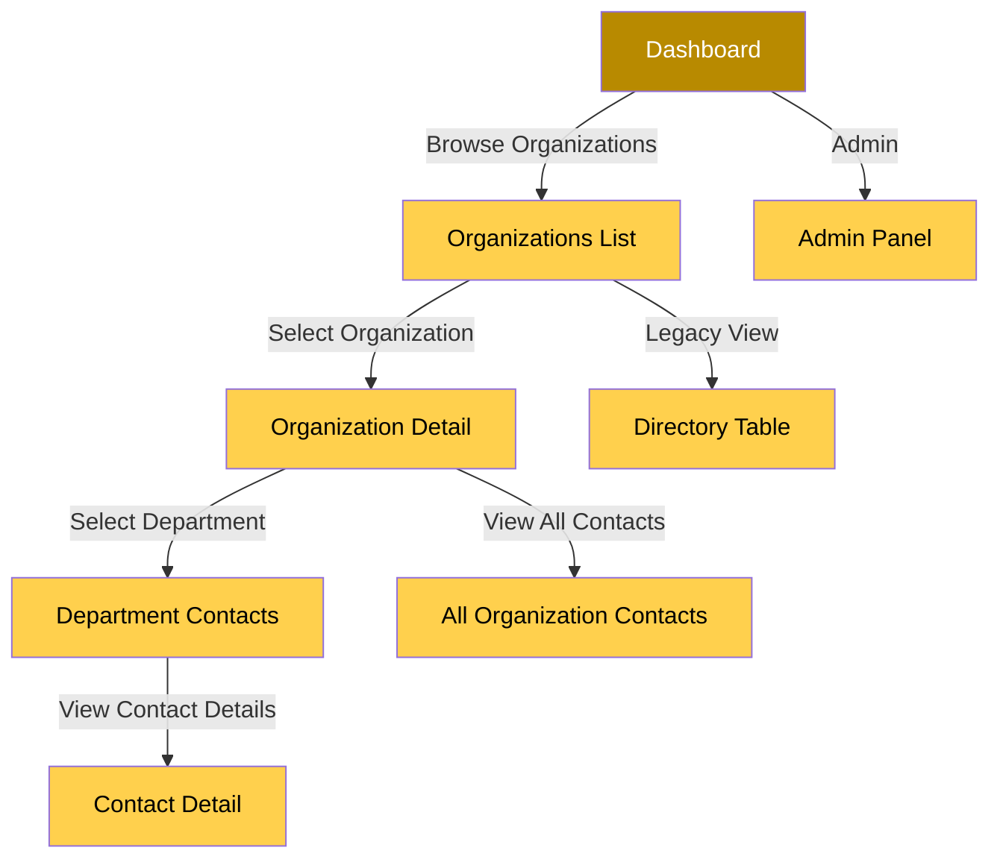

# Hierarchical Navigation Structure - Technical Specification

## Executive Summary

This document outlines the technical specification for implementing a hierarchical navigation structure for the Golden Pages Directory application. The hierarchy follows the pattern: **Organizations → Departments → Contacts**.

**Current State:**
- 64 organizations
- 1,028 contacts
- Departments stored as free-form strings in `Contact.department` field
- No separate Department model exists

**Recommended Approach:**
Use the existing string-based department field with a computed grouping mechanism. This avoids data migration and works with the current schema.

---

## 1. Schema Analysis

### Current Schema Structure

```prisma
model Contact {
  id                String                @id @default(uuid_generate_v4())
  fullName          String
  roleTitle         String?
  department        String?              // ← Current: free-form string
  organisation      Organisation          @relation(fields: [organisationId], references: [id])
  organisationId    String
  // ... other fields
}
```

### Department Data Characteristics

Based on analysis of seed data:

| Characteristic | Finding |
|---------------|----------|
| **Storage** | Free-form string field (`String?`) |
| **NULL Values** | ~40% of contacts have NULL department |
| **Naming Convention** | Inconsistent (e.g., "Finance", "Ministry of Finance", "Finance Department") |
| **Uniqueness** | Department names are organization-scoped, not globally unique |
| **Examples** | "Executive Office", "Finance", "Foreign Affairs", "Ministry of Education", "Blue House" |

### Proposed Schema Changes

```prisma
// ============================================================================
// NEW MODEL: Department
// ============================================================================
// NOTE: This model is enhanced to support Package Management System requirements
// including department codes for identification, hierarchical structure (sub-departments),
// and audit trail fields.
model Department {
  id             String       @id @default(uuid_generate_v4())
  name           String
  code           String?      @unique           // NEW: Department code (e.g., "FIN-001")
  description    String?                       // Optional: department description
  organisation   Organisation @relation("DepartmentOrganisation", fields: [organisationId], references: [id])
  organisationId String
  parentId       String?                       // NEW: Support for sub-departments (hierarchical)
  parent         Department?  @relation("DepartmentHierarchy", fields: [parentId], references: [id], onDelete: SetNull)
  children       Department[] @relation("DepartmentHierarchy")
  isActive       Boolean      @default(true)   // NEW: Active/inactive status

  // Audit fields for Package Management integration
  createdAt      DateTime     @default(now())
  createdBy      String?                      // NEW: User who created department
  updatedAt      DateTime     @updatedAt
  updatedBy      String?                      // NEW: User who last updated

  contacts       Contact[]

  @@unique([organisationId, name])
  @@index([organisationId])
  @@index([parentId])
  @@index([isActive])
  @@index([code])
  @@map("departments")
}

// ============================================================================
// UPDATED MODEL: Contact
// ============================================================================
model Contact {
  id                String                @id @default(uuid_generate_v4())
  fullName          String
  roleTitle         String?
  department        Department?            @relation("ContactDepartment", fields: [departmentId], references: [id])
  departmentId      String?              @unique  // NEW: Foreign key to Department
  departmentLegacy  String?              // NEW: Keep for migration/backward compatibility
  organisation      Organisation          @relation(fields: [organisationId], references: [id])
  organisationId    String
  primaryLocation   OrganisationLocation? @relation(fields: [primaryLocationId], references: [id])
  primaryLocationId String?

  // Optional owner for multi-tenancy
  ownerId           String?
  owner             User?                 @relation("ContactOwner", fields: [ownerId], references: [id])

  isHeadOfficeBased Boolean              @default(false)
  contactChannels   ContactChannel[]
  notes             ContactNote[]
  outreachLogs      OutreachLog[]
  createdAt         DateTime              @default(now())
  updatedAt         DateTime              @updatedAt

  @@index([organisationId])
  @@index([departmentId])
  @@map("contacts")
}

// ============================================================================
// UPDATED MODEL: Organisation
// ============================================================================
model Organisation {
  id                  String              @id @default(uuid_generate_v4())
  name                String
  type                OrganisationType
  headOfficeCountry   Region              @relation("OrganisationCountry", fields: [headOfficeCountryId], references: [id])
  headOfficeCountryId String
  headOfficeCity      String?
  headOfficeAddress   String?
  headOfficePhone     String?
  headOfficeEmail     String?
  headOfficeWebsite   String?
  description         String?

  // Optional owner for multi-tenancy
  ownerId            String?
  owner              User?               @relation("OrgOwner", fields: [ownerId], references: [id])

  contacts            Contact[]
  departments         Department[]         @relation("DepartmentOrganisation")  // NEW: Department relation
  locations           OrganisationLocation[]
  notes               OrganisationNote[]
  createdAt           DateTime            @default(now())
  updatedAt           DateTime            @updatedAt

  @@map("organisations")
}
```

### Schema Decision

**Recommendation: Add Department model with migration**

**Rationale:**
1. **Performance:** No runtime string grouping needed - database handles relationships efficiently
2. **Data Integrity:** Foreign key constraints ensure referential integrity
3. **Indexing:** Proper indexes on department queries
4. **Scalability:** Efficient joins for large datasets (1000+ contacts)
5. **Query Optimization:** Database can optimize department-based queries
6. **Future-proof:** Enables department-level permissions, metadata, and features

**Migration Required:** Yes - one-time migration script to normalize existing data
```prisma
// Enhanced Department model with Package Management System support
model Department {
  id             String    @id @default(uuid_generate_v4())
  name           String
  code           String?   @unique           // For package recipient identification
  description    String?
  organisation   Organisation @relation(fields: [organisationId], references: [id])
  organisationId String
  parentId       String?                      // Support for sub-departments
  parent         Department?  @relation("DepartmentHierarchy", fields: [parentId], references: [id], onDelete: SetNull)
  children       Department[] @relation("DepartmentHierarchy")
  isActive       Boolean   @default(true)    // For filtering active departments

  // Audit fields
  createdAt      DateTime  @default(now())
  createdBy      String?
  updatedAt      DateTime  @updatedAt
  updatedBy      String?

  contacts       Contact[]

  @@unique([organisationId, name])
  @@index([organisationId])
  @@index([parentId])
  @@index([isActive])
  @@index([code])
  @@map("departments")
}

// Update Contact model
model Contact {
  // ... existing fields
  department      Department? @relation(fields: [departmentId], references: [id])
  departmentId    String?
  departmentLegacy String?   // Keep for migration/backward compatibility
}
```

---

## 2. Page Structure & Routing

### Proposed Route Structure

```
/                           (Dashboard - existing)
/organizations               (Organizations list - new)
/organizations/[id]          (Organization detail with departments - new)
/organizations/[id]/departments/[dept]  (Department contacts - new)
/directory                   (Legacy directory view - existing)
/admin                      (Admin panel - existing)
```

### Route Descriptions

| Route | Purpose | Component |
|--------|---------|------------|
| `/` | Dashboard overview | `Dashboard` (existing) |
| `/organizations` | List all organizations with department counts | `OrganizationsList` (new) |
| `/organizations/[id]` | Organization detail with department list | `OrganizationDetail` (new) |
| `/organizations/[id]/departments/[dept]` | Contacts within a specific department | `DepartmentContacts` (new) |
| `/directory` | Legacy flat directory view | `OrganizationTable` (existing) |
| `/admin` | System administration | `AdminPanel` (existing) |

### Navigation Flow Diagram



---

## 3. Component Architecture

### Component Hierarchy

```
app/
├── layout.tsx                    (Root layout - existing)
├── page.tsx                      (Dashboard - existing)
├── organizations/
│   ├── page.tsx                 (Organizations list - NEW)
│   ├── [id]/
│   │   ├── page.tsx             (Organization detail - NEW)
│   │   └── departments/
│   │       └── [dept]/
│   │           └── page.tsx     (Department contacts - NEW)
├── directory/
│   └── page.tsx                 (Legacy directory - existing)
└── admin/
    └── page.tsx                 (Admin panel - existing)

components/
├── Dashboard.tsx                 (Existing)
├── OrganizationTable.tsx          (Existing - legacy)
├── OrgDetail.tsx                 (Existing - to be refactored)
├── Sidebar.tsx                  (Existing - update navigation)
├── hierarchy/
│   ├── OrganizationsList.tsx     (NEW)
│   ├── OrganizationCard.tsx      (NEW)
│   ├── DepartmentList.tsx         (NEW)
│   ├── DepartmentCard.tsx        (NEW)
│   ├── ContactList.tsx           (NEW)
│   ├── ContactCard.tsx           (NEW)
│   ├── BreadcrumbNav.tsx         (NEW)
│   └── DepartmentFilter.tsx       (NEW)
└── shared/
    ├── LoadingSpinner.tsx         (NEW)
    ├── EmptyState.tsx             (NEW)
    └── ErrorBoundary.tsx          (NEW)
```

### Component Specifications

#### 3.1 OrganizationsList (`/organizations/page.tsx`)

**Purpose:** Display all organizations with department counts

**Props:**
```typescript
interface OrganizationsListProps {
  organizations: OrganizationWithDeptCount[];
  loading: boolean;
  error?: Error;
}

interface OrganizationWithDeptCount extends Organization {
  departmentCount: number;
  contactCount: number;
}
```

**Features:**
- Search/filter by organization name
- Filter by organization type (government/corporate/diplomatic_mission)
- Sort by name, type, or contact count
- Display department count per organization
- Pagination (20 organizations per page)
- Click to navigate to organization detail

**Data Fetching:**
```typescript
// Query to get organizations with department counts
const { data } = await supabase
  .from('organisations')
  .select(`
    id,
    name,
    type,
    headOfficeCountryId,
    headOfficeCity,
    contacts(count),
    contacts!inner(department)
  `)
  .order('name');
```

#### 3.2 OrganizationDetail (`/organizations/[id]/page.tsx`)

**Purpose:** Display organization details and list of departments

**Props:**
```typescript
interface OrganizationDetailProps {
  organization: Organization;
  departments: DepartmentGroup[];
  contacts: Contact[];
  loading: boolean;
}

interface DepartmentGroup {
  name: string;
  contactCount: number;
  contacts: Contact[];
}
```

**Features:**
- Organization header with details
- List of departments with contact counts
- "All Contacts" view option
- Search/filter departments
- Sort departments by name or contact count
- Breadcrumb navigation
- Click department to view contacts

**Data Fetching:**
```typescript
// Get organization details
const { data: org } = await supabase
  .from('organisations')
  .select('*')
  .eq('id', params.id)
  .single();

// Get contacts grouped by department
const { data: contacts } = await supabase
  .from('contacts')
  .select('*')
  .eq('organisationId', params.id)
  .order('department');

// Group contacts by department
const departments = groupContactsByDepartment(contacts);
```

#### 3.3 DepartmentContacts (`/organizations/[id]/departments/[dept]/page.tsx`)

**Purpose:** Display all contacts within a specific department

**Props:**
```typescript
interface DepartmentContactsProps {
  organization: Organization;
  department: string;
  contacts: ContactWithChannels[];
  loading: boolean;
}

interface ContactWithChannels extends Contact {
  channels: ContactChannel[];
}
```

**Features:**
- Department header with organization context
- List of contacts with their channels
- Search/filter contacts by name or role
- Sort contacts by name or role
- Breadcrumb navigation
- Click contact to view details
- Pagination (25 contacts per page)

**Data Fetching:**
```typescript
// Get contacts for specific department
const { data: contacts } = await supabase
  .from('contacts')
  .select(`
    *,
    contact_channels(*)
  `)
  .eq('organisationId', params.id)
  .eq('department', decodeURIComponent(params.dept))
  .order('fullName');
```

#### 3.4 BreadcrumbNav (Shared Component)

**Purpose:** Display navigation breadcrumbs

**Props:**
```typescript
interface BreadcrumbNavProps {
  items: BreadcrumbItem[];
}

interface BreadcrumbItem {
  label: string;
  href: string;
}
```

**Example Usage:**
```tsx
<BreadcrumbNav
  items={[
    { label: 'Organizations', href: '/organizations' },
    { label: org.name, href: `/organizations/${org.id}` },
    { label: department, href: `/organizations/${org.id}/departments/${encodeURIComponent(department)}` }
  ]}
/>
```

#### 3.5 DepartmentList (Shared Component)

**Purpose:** Display departments as cards/grid

**Props:**
```typescript
interface DepartmentListProps {
  departments: DepartmentGroup[];
  organizationId: string;
  loading?: boolean;
}
```

**Features:**
- Grid layout (responsive)
- Department name
- Contact count badge
- Hover effects
- Click to navigate

---

## 4. Data Fetching Strategy

### 4.1 Fetching Patterns

#### Organizations List
```typescript
// Server Component (app/organizations/page.tsx)
async function getOrganizations() {
  const { data, error } = await supabase
    .from('organisations')
    .select(`
      id,
      name,
      type,
      headOfficeCity,
      headOfficeCountryId,
      departments(count),
      contacts(count)
    `)
    .order('name');

  if (error) throw error;

  // Department count is now directly from database
  const orgsWithDeptCount = data.map(org => ({
    ...org,
    departmentCount: org.departments?.[0]?.count || 0,
    contactCount: org.contacts?.[0]?.count || 0
  }));

  return orgsWithDeptCount;
}
```

#### Organization Detail
```typescript
// Server Component (app/organizations/[id]/page.tsx)
async function getOrganizationDetails(id: string) {
  // Get organization with departments
  const { data: org } = await supabase
    .from('organisations')
    .select(`
      *,
      departments(
        id,
        name,
        description,
        contacts(count)
      )
    `)
    .eq('id', id)
    .single();

  // Get contacts without department (Unassigned)
  const { data: unassignedContacts } = await supabase
    .from('contacts')
    .select('*')
    .eq('organisationId', id)
    .is('departmentId', 'is', null)
    .order('fullName');

  return {
    org,
    departments: org.departments || [],
    unassignedContacts: unassignedContacts || []
  };
}
```

#### Department Contacts
```typescript
// Server Component (app/organizations/[id]/departments/[dept]/page.tsx)
async function getDepartmentContacts(orgId: string, deptId: string) {
  // Get department details
  const { data: department } = await supabase
    .from('departments')
    .select('*')
    .eq('id', deptId)
    .single();

  // Get contacts for this department
  const { data: contacts } = await supabase
    .from('contacts')
    .select(`
      *,
      contact_channels(*)
    `)
    .eq('departmentId', deptId)
    .order('fullName');

  return { department, contacts: contacts || [] };
}
```

### 4.2 Performance Optimizations

#### Caching Strategy
```typescript
// lib/cache.ts
import { unstable_cacheLife as cacheLife } from 'next/cache';

export const revalidateOrganizations = cacheLife({
  revalidate: 3600, // 1 hour
  tags: ['organizations']
});

export const revalidateOrganization = cacheLife({
  revalidate: 1800, // 30 minutes
  tags: ['organization']
});

export const revalidateContacts = cacheLife({
  revalidate: 600, // 10 minutes
  tags: ['contacts']
});
```

#### Pagination
```typescript
// Use cursor-based pagination for large datasets
interface PaginatedResponse<T> {
  data: T[];
  nextCursor?: string;
  hasMore: boolean;
}

async function getPaginatedContacts(
  orgId: string,
  department: string,
  cursor?: string,
  limit: number = 25
): Promise<PaginatedResponse<Contact>> {
  let query = supabase
    .from('contacts')
    .select('*')
    .eq('organisationId', orgId)
    .eq('department', department)
    .order('fullName')
    .limit(limit);

  if (cursor) {
    query = query.gt('id', cursor);
  }

  const { data, error } = await query;
  
  return {
    data: data || [],
    nextCursor: data?.[data.length - 1]?.id,
    hasMore: data?.length === limit
  };
}
```

#### Lazy Loading
```typescript
// Use React Server Components for initial data
// Use Client Components with SWR for real-time updates
'use client';

import useSWR from 'swr';

function DepartmentContacts({ orgId, department }: Props) {
  const { data, error, isLoading } = useSWR(
    `/api/contacts/${orgId}/${encodeURIComponent(department)}`,
    fetcher
  );

  if (isLoading) return <LoadingSpinner />;
  if (error) return <ErrorState error={error} />;
  
  return <ContactList contacts={data} />;
}
```

### 4.3 API Routes (Optional)

For client-side data fetching with SWR:

```typescript
// app/api/contacts/[orgId]/[department]/route.ts
import { NextRequest, NextResponse } from 'next/server';

export async function GET(
  request: NextRequest,
  { params }: { params: { orgId: string; department: string } }
) {
  const { searchParams } = new URL(request.url);
  const page = parseInt(searchParams.get('page') || '1');
  const limit = parseInt(searchParams.get('limit') || '25');

  const { data, error } = await supabase
    .from('contacts')
    .select(`
      *,
      contact_channels(*)
    `)
    .eq('organisationId', params.orgId)
    .eq('department', decodeURIComponent(params.department))
    .range((page - 1) * limit, page * limit - 1)
    .order('fullName');

  if (error) {
    return NextResponse.json({ error: error.message }, { status: 500 });
  }

  return NextResponse.json({ data, page, limit });
}
```

---

## 5. RBAC Integration

### Permission Requirements

| Route | Required Permission | Role Access |
|-------|-------------------|--------------|
| `/organizations` | `org:read` | All roles |
| `/organizations/[id]` | `org:read` | All roles |
| `/organizations/[id]/departments/[dept]` | `contact:read` | All roles |
| Contact creation/edit | `contact:write` | Editor, Admin |
| Contact deletion | `contact:archive` | Editor, Admin |

### Permission Checks in Components

```typescript
// components/hierarchy/ContactCard.tsx
'use client';

import { usePermissions } from '@/lib/hooks/usePermissions';

function ContactCard({ contact }: { contact: Contact }) {
  const { hasPermission } = usePermissions();
  const canEdit = hasPermission('contact:write');
  const canDelete = hasPermission('contact:archive');

  return (
    <div className="contact-card">
      {/* Contact details */}
      {canEdit && <EditButton contact={contact} />}
      {canDelete && <DeleteButton contact={contact} />}
    </div>
  );
}
```

### RLS Policy Updates

```sql
-- Ensure RLS policies work with department filtering
CREATE POLICY "Users can read contacts by organization"
ON contacts FOR SELECT
USING (
  organisation_id IN (
    SELECT id FROM organisations
    WHERE owner_id = auth.uid()
    OR id IN (
      SELECT organisation_id FROM user_organisation_access
      WHERE user_id = auth.uid()
    )
  )
  OR EXISTS (
    SELECT 1 FROM user_roles ur
    JOIN roles r ON ur.role_id = r.id
    JOIN role_permissions rp ON r.id = rp.role_id
    WHERE ur.user_id = auth.uid()
    AND rp.permission = 'contact:read'
  )
);
```

---

## 6. TypeScript Types

```typescript
// types/hierarchy.ts

export interface OrganizationWithDeptCount extends Organization {
  departmentCount: number;
  contactCount: number;
}

export interface Department {
  id: string;
  name: string;
  organisationId: string;
  description?: string;
  contactCount?: number;
  createdAt: string;
  updatedAt: string;
}

export interface DepartmentWithContacts extends Department {
  contacts: Contact[];
}

export interface ContactWithChannels extends Contact {
  channels: ContactChannel[];
  department?: Department;
}

export interface BreadcrumbItem {
  label: string;
  href: string;
}

export interface PaginationParams {
  page: number;
  limit: number;
  cursor?: string;
}

export interface PaginatedResponse<T> {
  data: T[];
  nextCursor?: string;
  hasMore: boolean;
  total: number;
}

// Migration types
export interface ContactWithLegacyDept {
  id: string;
  organisationId: string;
  department: string | null;
  departmentId?: string | null;
  departmentLegacy?: string | null;
}

export interface DepartmentCreateInput {
  name: string;
  organisationId: string;
  description?: string;
}

export interface DepartmentUpdateInput {
  name?: string;
  description?: string;
}
```

---

## 7. Implementation Phases

### Phase 0: Database Migration (Week 1)
- [ ] Backup production database
- [ ] Review migration script in staging environment
- [ ] Run Prisma migration: `npx prisma migrate dev --name add_department_model`
- [ ] Execute department migration script
- [ ] Verify migration results (department counts, contact mappings)
- [ ] Update RLS policies for departments table
- [ ] Test rollback procedure in staging
- [ ] Document migration process

### Phase 1: Foundation (Week 2)
- [ ] Create route structure (`/organizations`, `/organizations/[id]`, `/organizations/[id]/departments/[dept]`)
- [ ] Implement `OrganizationsList` component
- [ ] Implement `OrganizationDetail` component
- [ ] Implement `DepartmentContacts` component
- [ ] Create shared components (`BreadcrumbNav`, `LoadingSpinner`, `EmptyState`)
- [ ] Update TypeScript types for Department model

### Phase 2: Data Layer (Week 3)
- [ ] Implement data fetching functions with Department model
- [ ] Add caching strategy with Next.js cache tags
- [ ] Implement pagination for large datasets
- [ ] Create API routes for client-side fetching (if needed)
- [ ] Add database indexes for performance

### Phase 3: Integration (Week 4)
- [ ] Update `Sidebar` navigation with new routes
- [ ] Integrate RBAC permissions for department operations
- [ ] Add search/filter functionality
- [ ] Implement error handling and error boundaries
- [ ] Add loading and empty states

### Phase 4: Polish (Week 5)
- [ ] Add animations and transitions
- [ ] Performance optimization (code splitting, lazy loading)
- [ ] Accessibility improvements
- [ ] Cross-browser testing
- [ ] Mobile responsiveness verification
- [ ] User acceptance testing

---

## 8. Edge Cases & Considerations

### 8.1 NULL Departments (Pre-Migration)
- **Issue:** ~40% of contacts have NULL department
- **Solution:** During migration, create "Unassigned" department for NULL values
- **Post-Migration:** All contacts will have a department (either real or "Unassigned")
- **UI:** Display "Unassigned" department with all contacts without a specific department

### 8.2 Department Name Variations
- **Issue:** "Finance", "Finance Department", "Ministry of Finance"
- **Solution:** Migration preserves original names; display as-is
- **Future Enhancement:** Add department normalization/mapping if needed
- **UI:** Show department names exactly as stored

### 8.3 Special Characters in Department Names
- **Issue:** Department names may contain spaces, special characters
- **Solution:** Use department ID in URLs (not name), `encodeURIComponent()` for display
- **Routing:** Use `/organizations/[id]/departments/[deptId]` instead of department name

### 8.4 Large Organizations
- **Issue:** Some organizations may have 50+ departments
- **Solution:** Implement pagination for department lists (20 departments per page)
- **UI:** Show pagination controls or "Load more" button
- **Performance:** Lazy load department cards

### 8.5 Empty Organizations
- **Issue:** Organizations with no contacts or departments
- **Solution:** Display empty state with "No contacts available" message
- **UI:** Show option to add contacts (if user has `contact:write` permission)

### 8.6 Department Deletion
- **Issue:** What happens when a department is deleted?
- **Solution:** Set `departmentId` to NULL for all contacts in that department
- **Migration:** Create "Unassigned" department to reassign contacts
- **UI:** Show warning before deletion with contact count

### 8.7 Duplicate Department Names
- **Issue:** Same department name within an organization
- **Solution:** Database constraint prevents duplicates (`@@unique([organisationId, name])`)
- **UI:** Show error message when attempting to create duplicate

### 8.8 Department Renaming
- **Issue:** Renaming a department affects all contacts
- **Solution:** Update department name in one place (cascades to contacts)
- **UI:** Show confirmation with contact count

### 8.9 Cross-Organization Departments
- **Issue:** Same department name across different organizations
- **Solution:** Allowed (unique constraint is per organization)
- **UI:** Display organization context in department views

---

## 9. Performance Metrics

### Target Performance
| Metric | Target |
|--------|--------|
| Organizations list load time | < 500ms |
| Organization detail load time | < 300ms |
| Department contacts load time | < 200ms |
| Time to interactive | < 2s |
| First contentful paint | < 1s |

### Optimization Checklist
- [ ] Implement React Server Components for initial data
- [ ] Use Next.js Image optimization for avatars
- [ ] Implement code splitting for large components
- [ ] Add caching headers for API responses
- [ ] Use database indexes on frequently queried fields
- [ ] Implement lazy loading for images
- [ ] Minimize bundle size with tree shaking

---

## 10. Testing Strategy

### Unit Tests
```typescript
// __tests__/components/OrganizationsList.test.tsx
describe('OrganizationsList', () => {
  it('renders organizations with department counts', () => {
    const mockOrgs = [
      { id: '1', name: 'Test Org', departmentCount: 5, contactCount: 20 }
    ];
    render(<OrganizationsList organizations={mockOrgs} />);
    expect(screen.getByText('Test Org')).toBeInTheDocument();
    expect(screen.getByText('5 Departments')).toBeInTheDocument();
  });

  it('filters organizations by search term', () => {
    // Test search functionality
  });
});
```

### Integration Tests
```typescript
// __tests__/integration/hierarchy.test.ts
describe('Hierarchy Navigation', () => {
  it('navigates from organizations to department contacts', async () => {
    render(<App />);
    await userEvent.click(screen.getByText('Organizations'));
    await userEvent.click(screen.getByText('Test Org'));
    await userEvent.click(screen.getByText('Finance'));
    expect(screen.getByText('Finance Contacts')).toBeInTheDocument();
  });
});
```

### E2E Tests
```typescript
// e2e/hierarchy.spec.ts
test('complete hierarchy navigation flow', async ({ page }) => {
  await page.goto('/organizations');
  await page.click('text=Test Organization');
  await page.click('text=Finance Department');
  await expect(page.locator('text=John Doe')).toBeVisible();
});
```

---

## 11. Migration Plan

### Overview
This migration will:
1. Add the `Department` model to the schema
2. Update the `Contact` model to reference departments
3. Migrate existing department strings to proper department records
4. Update RLS policies for the new model
5. Maintain backward compatibility during transition

### Step 1: Schema Changes

#### 1.1 Add Department Model
```prisma
model Department {
  id             String       @id @default(uuid_generate_v4())
  name           String
  organisation   Organisation @relation("DepartmentOrganisation", fields: [organisationId], references: [id])
  organisationId String
  contacts       Contact[]
  description    String?
  createdAt      DateTime     @default(now())
  updatedAt      DateTime     @updatedAt

  @@unique([organisationId, name])
  @@index([organisationId])
  @@index([name])
  @@map("departments")
}
```

#### 1.2 Update Contact Model
```prisma
model Contact {
  id                String                @id @default(uuid_generate_v4())
  fullName          String
  roleTitle         String?
  department        Department?            @relation("ContactDepartment", fields: [departmentId], references: [id])
  departmentId      String?              @unique
  departmentLegacy  String?              // Keep for migration/backward compatibility
  organisation      Organisation          @relation(fields: [organisationId], references: [id])
  organisationId    String
  // ... rest of existing fields
}
```

#### 1.3 Update Organisation Model
```prisma
model Organisation {
  // ... existing fields
  departments         Department[]         @relation("DepartmentOrganisation")
  // ... rest of existing fields
}
```

### Step 2: Database Migration Script

```typescript
// scripts/migrate-departments.ts
import { supabase } from '@/services/supabaseClient';

interface ContactWithDept {
  id: string;
  organisationId: string;
  department: string | null;
}

interface DepartmentRecord {
  id: string;
  name: string;
  organisationId: string;
}

async function migrateDepartments() {
  console.log('🚀 Starting department migration...');

  // Step 1: Get all contacts with non-null departments
  console.log('📊 Fetching contacts with departments...');
  const { data: contacts, error: fetchError } = await supabase
    .from('contacts')
    .select('id, organisationId, department')
    .not('department', 'is', null);

  if (fetchError) {
    console.error('❌ Error fetching contacts:', fetchError);
    throw fetchError;
  }

  console.log(`✓ Found ${contacts.length} contacts with departments`);

  // Step 2: Group contacts by organization and department
  console.log('🔄 Grouping contacts by organization and department...');
  const deptMap = new Map<string, DepartmentRecord>();
  const contactDeptMap = new Map<string, string>();

  for (const contact of contacts as ContactWithDept[]) {
    const key = `${contact.organisationId}:${contact.department}`;
    
    if (!deptMap.has(key)) {
      // This is a new department - we'll create it
      deptMap.set(key, {
        id: crypto.randomUUID(),
        name: contact.department!,
        organisationId: contact.organisationId
      });
    }
    
    // Map contact to department ID
    contactDeptMap.set(contact.id, deptMap.get(key)!.id);
  }

  console.log(`✓ Identified ${deptMap.size} unique departments`);

  // Step 3: Create departments in batches
  console.log('📝 Creating department records...');
  const departmentsToCreate = Array.from(deptMap.values());
  const batchSize = 100;
  const createdDepts: DepartmentRecord[] = [];

  for (let i = 0; i < departmentsToCreate.length; i += batchSize) {
    const batch = departmentsToCreate.slice(i, i + batchSize);
    const { data, error } = await supabase
      .from('departments')
      .insert(batch)
      .select('id, name, organisationId');

    if (error) {
      console.error(`❌ Error creating batch ${i / batchSize}:`, error);
      throw error;
    }

    createdDepts.push(...(data || []));
    console.log(`✓ Created batch ${i / batchSize + 1}/${Math.ceil(departmentsToCreate.length / batchSize)}`);
  }

  console.log(`✓ Created ${createdDepts.length} departments`);

  // Step 4: Update contacts with department IDs
  console.log('🔄 Updating contacts with department IDs...');
  const contactUpdates = Array.from(contactDeptMap.entries()).map(([contactId, deptId]) => ({
    id: contactId,
    departmentId: deptId
  }));

  let updatedCount = 0;
  for (let i = 0; i < contactUpdates.length; i += batchSize) {
    const batch = contactUpdates.slice(i, i + batchSize);
    
    for (const update of batch) {
      const { error } = await supabase
        .from('contacts')
        .update({ departmentId: update.departmentId })
        .eq('id', update.id);

      if (error) {
        console.error(`❌ Error updating contact ${update.id}:`, error);
      } else {
        updatedCount++;
      }
    }

    if ((i / batchSize) % 5 === 0) {
      console.log(`✓ Updated ${updatedCount}/${contactUpdates.length} contacts`);
    }
  }

  console.log(`✓ Updated ${updatedCount} contacts with department IDs`);

  // Step 5: Verification
  console.log('🔍 Verifying migration...');
  const { data: verifyDepts, error: verifyError } = await supabase
    .from('departments')
    .select('count', { count: 'exact', head: true });

  const { data: verifyContacts, error: verifyContactsError } = await supabase
    .from('contacts')
    .select('count', { count: 'exact', head: true })
    .not('departmentId', 'is', null);

  console.log(`✓ Total departments: ${verifyDepts?.[0]?.count || 0}`);
  console.log(`✓ Contacts with departments: ${verifyContacts?.[0]?.count || 0}`);

  console.log('✅ Migration completed successfully!');
}

// Run migration
migrateDepartments().catch(console.error);
```

### Step 3: RLS Policy Updates

```sql
-- ============================================================================
-- DEPARTMENT TABLE RLS POLICIES
-- ============================================================================

-- Enable RLS
ALTER TABLE departments ENABLE ROW LEVEL SECURITY;

-- Policy: Users can read departments of organizations they have access to
CREATE POLICY "Users can read departments by organization access"
ON departments FOR SELECT
USING (
  organisation_id IN (
    SELECT id FROM organisations
    WHERE owner_id = auth.uid()
    OR id IN (
      SELECT organisation_id FROM user_organisation_access
      WHERE user_id = auth.uid()
    )
  )
  OR EXISTS (
    SELECT 1 FROM user_roles ur
    JOIN roles r ON ur.role_id = r.id
    JOIN role_permissions rp ON r.id = rp.role_id
    WHERE ur.user_id = auth.uid()
    AND rp.permission = 'org:read'
  )
);

-- Policy: Editors and admins can create departments
CREATE POLICY "Editors and admins can create departments"
ON departments FOR INSERT
WITH CHECK (
  EXISTS (
    SELECT 1 FROM user_roles ur
    JOIN roles r ON ur.role_id = r.id
    JOIN role_permissions rp ON r.id = rp.role_id
    WHERE ur.user_id = auth.uid()
    AND rp.permission IN ('org:write', '*:*')
  )
);

-- Policy: Editors and admins can update departments
CREATE POLICY "Editors and admins can update departments"
ON departments FOR UPDATE
USING (
  EXISTS (
    SELECT 1 FROM user_roles ur
    JOIN roles r ON ur.role_id = r.id
    JOIN role_permissions rp ON r.id = rp.role_id
    WHERE ur.user_id = auth.uid()
    AND rp.permission IN ('org:write', '*:*')
  )
);

-- Policy: Admins can delete departments
CREATE POLICY "Admins can delete departments"
ON departments FOR DELETE
USING (
  EXISTS (
    SELECT 1 FROM user_roles ur
    JOIN roles r ON ur.role_id = r.id
    JOIN role_permissions rp ON r.id = rp.role_id
    WHERE ur.user_id = auth.uid()
    AND rp.permission = '*:*'
  )
);

-- ============================================================================
-- CONTACT TABLE RLS POLICY UPDATES
-- ============================================================================

-- Update existing policies to work with departmentId
CREATE POLICY "Users can read contacts by department access"
ON contacts FOR SELECT
USING (
  department_id IN (
    SELECT id FROM departments
    WHERE organisation_id IN (
      SELECT id FROM organisations
      WHERE owner_id = auth.uid()
      OR id IN (
        SELECT organisation_id FROM user_organisation_access
        WHERE user_id = auth.uid()
      )
    )
  )
  OR EXISTS (
    SELECT 1 FROM user_roles ur
    JOIN roles r ON ur.role_id = r.id
    JOIN role_permissions rp ON r.id = rp.role_id
    WHERE ur.user_id = auth.uid()
    AND rp.permission = 'contact:read'
  )
);
```

### Step 4: Rollback Plan

```typescript
// scripts/rollback-departments.ts
async function rollbackDepartments() {
  console.log('🔄 Starting rollback...');

  // Step 1: Get all contacts with departmentId
  const { data: contacts } = await supabase
    .from('contacts')
    .select('id, departmentId, departmentLegacy')
    .not('departmentId', 'is', null);

  // Step 2: Restore departmentLegacy to department field
  for (const contact of contacts) {
    await supabase
      .from('contacts')
      .update({ 
        department: contact.departmentLegacy,
        departmentId: null 
      })
      .eq('id', contact.id);
  }

  // Step 3: Delete all departments
  await supabase
    .from('departments')
    .delete()
    .neq('id', '00000000-0000-0000-0000-000000000000');

  console.log('✅ Rollback completed');
}
```

### Step 5: Migration Execution Checklist

- [ ] Backup database before migration
- [ ] Review migration script in staging environment
- [ ] Run Prisma migration: `npx prisma migrate dev --name add_department_model`
- [ ] Execute migration script
- [ ] Verify department counts match expected values
- [ ] Test application with new schema
- [ ] Update RLS policies
- [ ] Monitor performance metrics
- [ ] Document any issues found
- [ ] Prepare rollback plan (if needed)

### Step 6: Post-Migration Tasks

- [ ] Remove `departmentLegacy` field after verification period (30 days)
- [ ] Update TypeScript types
- [ ] Update API documentation
- [ ] Train users on new navigation structure
- [ ] Monitor query performance
- [ ] Add database indexes if needed

---

## 12. Summary

### Key Decisions
1. **Schema:** Add Department model with migration (proper normalization)
2. **Routing:** Use Next.js App Router with nested routes
3. **Components:** Server Components for data fetching, Client Components for interactivity
4. **Performance:** Implement caching, pagination, and lazy loading
5. **RBAC:** Integrate with existing permission system
6. **Scalability:** Design for 64+ organizations and 1000+ contacts
7. **Data Integrity:** Foreign key constraints ensure referential integrity
8. **Query Optimization:** Database indexes on frequently queried fields

### Performance Benefits of Department Model
| Aspect | String-Based | Department Model |
|---------|--------------|------------------|
| **Query Performance** | Requires runtime grouping | Direct database joins |
| **Indexing** | Limited (text field) | Proper indexes on foreign keys |
| **Data Integrity** | No constraints | Foreign key constraints |
| **Scalability** | O(n) grouping per request | O(1) database lookups |
| **Caching** | Difficult (dynamic grouping) | Easy (stable department IDs) |

### Next Steps
1. Review and approve this specification
2. Set up development branch
3. Run database migration (Prisma + migration script)
4. Begin Phase 1 implementation
5. Conduct code reviews after each phase
6. User acceptance testing before deployment
7. Monitor performance metrics post-deployment

---

## 13. Integration with Package Management System

### Dependency Overview

This specification serves as the **foundation layer** for the Package Management System (`package-management-spec.md`). The hierarchical structure of Organizations → Departments → Contacts enables the package management features.

```
┌─────────────────────────────────────────────────────────────────┐
│              FOUNDATION (This Spec)                             │
│  hierarchical-navigation-spec.md                                │
│  ┌──────────────┐     ┌──────────────┐     ┌──────────────┐    │
│  │Organization  │────▶│  Department  │────▶│   Contact    │    │
│  │              │     │              │     │              │    │
│  │ - name       │     │ - name       │     │ - fullName   │    │
│  │ - type       │     │ - code       │     │ - email      │    │
│  │ - location   │     │ - parentId   │     │ - phone      │    │
│  └──────────────┘     └──────────────┘     └──────────────┘    │
└─────────────────────────────────────────────────────────────────┘
                              │
                              ▼
┌─────────────────────────────────────────────────────────────────┐
│              FEATURE LAYER (Depends on Foundation)              │
│  package-management-spec.md                                      │
│  ┌──────────────┐     ┌──────────────┐                          │
│  │   Package    │────▶│Sub-Package   │───▶ Documents           │
│  │              │     │              │                          │
│  │ - name       │     │ - name       │                          │
│  │ - status     │     │ - deadline   │                          │
│  └──────────────┘     └──────────────┘                          │
│         │                                                        │
│         ▼                                                        │
│  ┌──────────────────────────────────────┐                       │
│  │    PackageRecipient (Departments)    │◀──── Uses Department  │
│  │    - deliveryStatus                  │      model from       │
│  │    - sentAt                          │      foundation       │
│  └──────────────────────────────────────┘                       │
└─────────────────────────────────────────────────────────────────┘
```

### Department Model Enhancements for Package Management

The `Department` model in this specification includes the following enhancements specifically designed for the Package Management System:

| Field | Purpose | Package Management Use Case |
|-------|---------|----------------------------|
| `code` | Unique department identifier | Used as recipient identifier in package delivery |
| `parentId` | Hierarchical structure | Enables targeting sub-departments or entire hierarchies |
| `isActive` | Active/inactive status | Filter out inactive departments when sending packages |
| `createdBy/updatedBy` | Audit trail | Track who created/modified departments for compliance |

### How Package Management Uses This Foundation

1. **Department Selection**: When creating a package, users select recipient departments from the departments created via this spec
2. **Contact Lookup**: Package delivery looks up primary contacts within departments
3. **Hierarchy Support**: Users can target an entire department hierarchy (parent + all children)
4. **Delivery Tracking**: Package status is tracked per department

### Implementation Order

**IMPORTANT**: Implement this specification FIRST, then the Package Management System:

| Phase | Specification | Duration | Dependencies |
|-------|---------------|----------|--------------|
| 1 | `hierarchical-navigation-spec.md` | Weeks 1-5 | None (Foundation) |
| 2 | `package-management-spec.md` | Weeks 6-11 | **Requires Phase 1 completion** |

### Shared Permissions

Both specifications use the same RBAC permissions:

| Permission | Used By | Purpose |
|------------|---------|---------|
| `org:read` | Both | View organizations/structure |
| `org:write` | Both | Create/edit organizations |
| `department:read` | Both | View departments |
| `department:write` | Both | Create/edit departments |
| `contact:read` | Both | View contacts |
| `contact:write` | Both | Create/edit contacts |

### Related Specifications

- **Package Management System**: See `package-management-spec.md` for full details on package creation, delivery, and tracking
- **Both specifications should be implemented together** for complete functionality

---

**Document Version:** 1.1
**Last Updated:** 2026-01-30
**Author:** Architect Mode
**Related Specs**: package-management-spec.md
