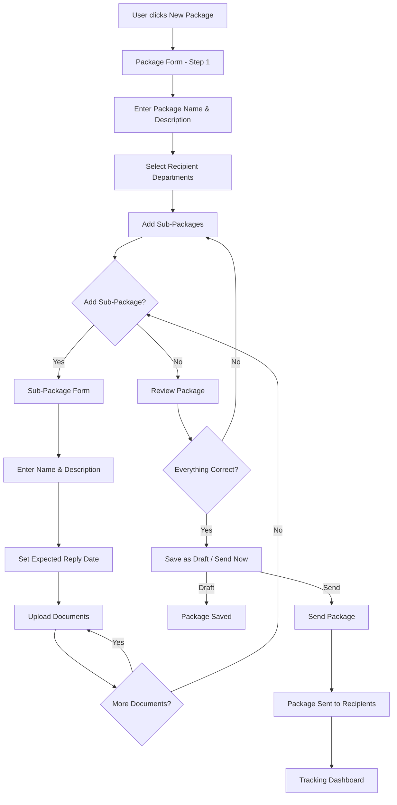
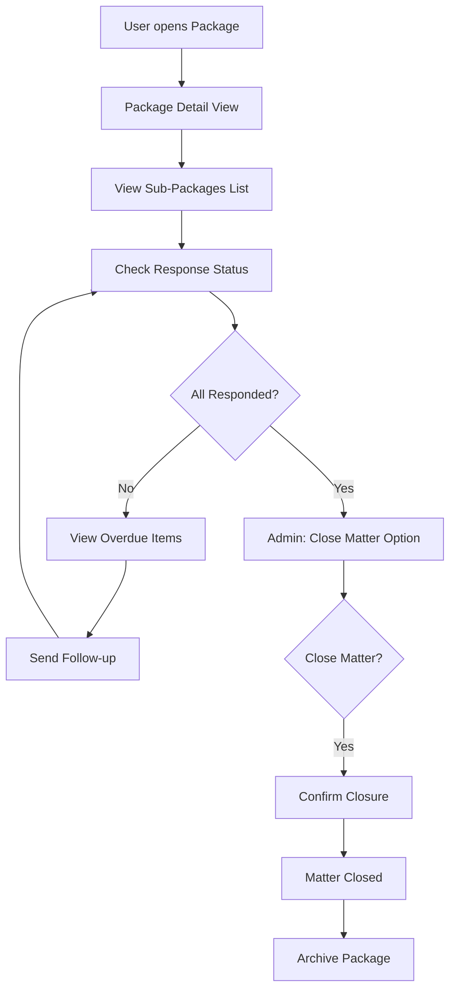
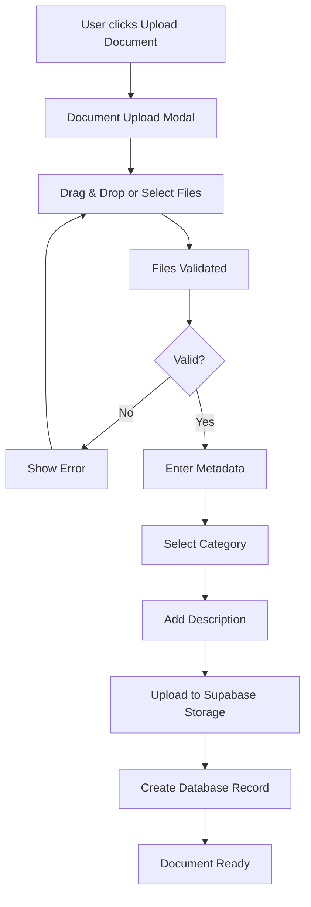

# Package Management System - Technical Specification

## Executive Summary

The Package Management System is a comprehensive feature for Golden Pages that enables organizations to create, send, and track document packages to departments worldwide. The system supports hierarchical package structures (packages containing sub-packages), department targeting, document attachments, reply deadline tracking, and matter lifecycle management.

### Prerequisite Specification

**This specification depends on the `hierarchical-navigation-spec.md`** which must be implemented first. The hierarchical navigation provides the foundational **Organizations → Departments → Contacts** structure that this system uses for:
- Department recipient selection
- Contact lookup for package delivery
- Department hierarchy targeting (parent + children departments)

**Implementation Order:**
1. **First**: `hierarchical-navigation-spec.md` (Foundation Layer) - Weeks 1-5
2. **Second**: `package-management-spec.md` (Feature Layer) - Weeks 6-11

---

## 1. Business Requirements

### 1.1 Core Use Cases

| Use Case | Description | Actors |
|----------|-------------|--------|
| Create Package | Create a new package with a name (e.g., "Digital ID") | Admin, Editor |
| Add Sub-Packages | Add sub-packages with names (e.g., "Notice One", "Notice to Respond") and attach documents | Admin, Editor |
| Select Recipients | Select departments to send the package to | Admin, Editor |
| Send Package | Send package to selected departments with tracking | Admin, Editor |
| Track Replies | Track expected reply dates and received responses | Admin, Editor, User |
| Close Matter | Admin closes a matter when all sub-packages are completed | Admin |
| View History | View complete history of sent packages and responses | All Roles |

### 1.2 User Stories

1. **As an Admin**, I want to create packages with multiple sub-packages so that I can send comprehensive document sets to departments.
2. **As an Editor**, I want to select specific departments as recipients so that I can target the right audience.
3. **As an Editor**, I want to attach documents to sub-packages so that recipients receive all necessary materials.
4. **As an Admin**, I want to track expected reply dates so that I can follow up on overdue responses.
5. **As a User**, I want to view sent packages and their status so that I can stay informed.
6. **As an Admin**, I want to close matters when complete so that the system reflects accurate status.

---

## 2. Database Schema Design

### 2.1 Entity Relationship Diagram

```
┌─────────────────┐       ┌──────────────────┐       ┌─────────────────┐
│   packages      │───┬───│  sub_packages    │───┬───│  package_docs   │
│                 │   │   │                  │   │   │                 │
│ - id            │   │   │ - id             │   │   │ - id            │
│ - name          │   │   │ - package_id     │   │   │ - sub_package_id│
│ - description   │   │   │ - name           │   │   │ - document_id   │
│ - status        │   │   │ - description    │   │   │ - attached_at   │
│ - created_at    │   │   │ - status         │   │   └─────────────────┘
│ - created_by    │   │   │ - expected_reply │           │
│ - updated_at    │   │   │ - sent_at        │           │
│ - updated_by    │   │   │ - created_at     │           │
│ - closed_at     │   │   │ - created_by     │           │
│ - closed_by     │   │   │ - updated_at     │           │
└─────────────────┘   │   │ - updated_by     │           │
                      │   └──────────────────┘           │
                      │                                  │
┌─────────────────┐   │                                  │
│ package_recipients│ │                                  │
│                 │   │                                  │
│ - id            │   │                                  │
│ - package_id    │◄──┘                                  │
│ - department_id │                                      │
│ - sent_at       │                                      │
│ - delivery_status│                                     │
│ - created_at    │                                      │
│ - created_by    │                                      │
└─────────────────┘                                      │
        │                                                │
        │                                                │
┌─────────────────┐                              ┌─────────────────┐
│  departments    │                              │   documents     │
│                 │                              │                 │
│ - id            │                              │ - id            │
│ - name          │                              │ - filename      │
│ - code          │                              │ - original_name │
│ - organisation_id│                             │ - mime_type     │
│ - parent_id     │                              │ - size_bytes    │
│ - description   │                              │ - storage_path  │
│ - is_active     │                              │ - created_at    │
│ - created_at    │                              │ - created_by    │
│ - created_by    │                              │ - checksum      │
│ - updated_at    │                              └─────────────────┘
│ - updated_by    │
└─────────────────┘
```

### 2.2 Prisma Schema

```prisma
// ============================================================================
// DEPARTMENTS TABLE
// ============================================================================
// NOTE: This model is defined in hierarchical-navigation-spec.md (Foundation Layer)
// The model is shown here for reference only - implement via that spec first.
//
// The Department model includes the following enhancements for Package Management:
// - code: Unique identifier for package recipient selection
// - parentId: Hierarchical support for targeting department trees
// - isActive: Filter for active departments only
// - createdBy/updatedBy: Audit trail for compliance
//
// See hierarchical-navigation-spec.md for the complete model definition.
//
// Additional relations added by this spec (Package Management):
model Department {
  // ... fields defined in hierarchical-navigation-spec.md ...

  // Additional reverse relations for Package Management
  packageRecipients PackageRecipient[]  // NEW: Which packages were sent to this department

  // Note: contacts relation is already defined in hierarchical-navigation-spec.md
}

// Contact model extension - also defined in hierarchical-navigation-spec.md
// The departmentId and department relation are already added in that spec.
model Contact {
  // ... fields defined in hierarchical-navigation-spec.md ...
  // departmentId and department relation are already included
}

// ============================================================================
// PACKAGES TABLE
// ============================================================================
model Package {
  id            String   @id @default(uuid_generate_v4())
  name          String   @db.VarChar(255)
  description   String?  @db.Text

  // Status: draft, pending, sent, partial, completed, closed, cancelled
  status        PackageStatus @default(DRAFT)

  // Matter closure
  closedAt      DateTime? @map("closed_at")
  closedBy      String?   @map("closed_by")

  createdAt     DateTime  @default(now()) @map("created_at")
  createdBy     String    @map("created_by")
  updatedAt     DateTime  @updatedAt @map("updated_at")
  updatedBy     String?   @map("updated_by")

  // Relations
  creator       User     @relation("PackageCreator", fields: [createdBy], references: [id])
  closer        User?    @relation("PackageCloser", fields: [closedBy], references: [id])

  subPackages   SubPackage[]
  recipients    PackageRecipient[]

  @@index([status])
  @@index([createdBy])
  @@index([closedAt])
  @@map("packages")
}

enum PackageStatus {
  DRAFT       // Being created
  PENDING     // Ready to send
  SENT        // Fully sent to all recipients
  PARTIAL     // Partially sent
  COMPLETED   // All sub-packages responded
  CLOSED      // Matter closed by admin
  CANCELLED   // Cancelled
}

// ============================================================================
// SUB-PACKAGES TABLE
// ============================================================================
model SubPackage {
  id            String    @id @default(uuid_generate_v4())
  packageId     String    @map("package_id")
  name          String    @db.VarChar(255) // e.g., "Notice One", "Notice to Respond"
  description   String?   @db.Text
  sequence      Int       @default(0) // Order within package

  // Reply tracking
  expectedReply DateTime? @map("expected_reply") // When reply is expected
  actualReply   DateTime? @map("actual_reply")   // When reply was received

  // Status: draft, ready, sent, responded, overdue, cancelled
  status        SubPackageStatus @default(DRAFT)

  sentAt        DateTime? @map("sent_at")

  createdAt     DateTime  @default(now()) @map("created_at")
  createdBy     String    @map("created_by")
  updatedAt     DateTime  @updatedAt @map("updated_at")
  updatedBy     String?   @map("updated_by")

  // Relations
  package       Package   @relation(fields: [packageId], references: [id], onDelete: Cascade)
  creator       User      @relation("SubPackageCreator", fields: [createdBy], references: [id])

  documents     PackageDocument[]
  responses     SubPackageResponse[]

  @@index([packageId])
  @@index([status])
  @@index([expectedReply])
  @@map("sub_packages")
}

enum SubPackageStatus {
  DRAFT     // Being created
  READY     // Ready to send
  SENT      // Sent to recipients
  RESPONDED // Response received
  OVERDUE   // Past expected reply without response
  CANCELLED // Cancelled
}

// ============================================================================
// DOCUMENTS TABLE
// ============================================================================
model Document {
  id            String   @id @default(uuid_generate_v4())
  filename      String   @db.VarChar(255)
  originalName  String   @map("original_name") @db.VarChar(255)
  mimeType      String   @map("mime_type") @db.VarChar(100)
  sizeBytes     Int      @map("size_bytes")
  storagePath   String   @map("storage_path") @db.VarChar(500) // Supabase Storage path
  checksum      String?  @db.VarChar(64) // SHA-256 for integrity verification

  description   String?  @db.Text
  category      DocumentCategory? @default(OTHER) // notice, form, certificate, other

  createdAt     DateTime @default(now()) @map("created_at")
  createdBy     String   @map("created_by")

  // Relations
  creator       User     @relation("DocumentCreator", fields: [createdBy], references: [id])

  attachments   PackageDocument[]

  @@index([createdBy])
  @@index([category])
  @@map("documents")
}

enum DocumentCategory {
  NOTICE
  FORM
  CERTIFICATE
  CORRESPONDENCE
  REPORT
  OTHER
}

// ============================================================================
// PACKAGE DOCUMENTS (Junction Table)
// ============================================================================
model PackageDocument {
  id            String   @id @default(uuid_generate_v4())
  subPackageId  String   @map("sub_package_id")
  documentId    String   @map("document_id")

  attachedAt    DateTime @default(now()) @map("attached_at")
  attachedBy    String   @map("attached_by")
  description   String?  @db.Text // Optional description for this attachment

  // Relations
  subPackage    SubPackage @relation(fields: [subPackageId], references: [id], onDelete: Cascade)
  document      Document   @relation(fields: [documentId], references: [id], onDelete: Cascade)

  @@unique([subPackageId, documentId])
  @@index([subPackageId])
  @@map("package_documents")
}

// ============================================================================
// PACKAGE RECIPIENTS (Which departments received which packages)
// ============================================================================
model PackageRecipient {
  id            String   @id @default(uuid_generate_v4())
  packageId     String   @map("package_id")
  departmentId  String   @map("department_id")

  // Delivery tracking
  deliveryStatus DeliveryStatus @default(PENDING)
  sentAt        DateTime? @map("sent_at")
  deliveredAt   DateTime? @map("delivered_at")

  // Recipient details (snapshot)
  recipientName String?  @map("recipient_name") // Snapshot of department name at time of sending
  recipientEmail String? @map("recipient_email") // Primary contact email

  // Notes
  notes         String?  @db.Text

  createdAt     DateTime @default(now()) @map("created_at")
  createdBy     String   @map("created_by")

  // Relations
  package       Package    @relation(fields: [packageId], references: [id], onDelete: Cascade)
  department    Department @relation(fields: [departmentId], references: [id], onDelete: Cascade)

  @@unique([packageId, departmentId])
  @@index([packageId])
  @@index([departmentId])
  @@index([deliveryStatus])
  @@map("package_recipients")
}

enum DeliveryStatus {
  PENDING     // Not yet sent
  SENDING     // In progress
  SENT        // Sent successfully
  DELIVERED   // Confirmed delivery
  FAILED      // Send failed
  BOUNCED     // Email bounced
}

// ============================================================================
// SUB-PACKAGE RESPONSES (Track responses from departments)
// ============================================================================
model SubPackageResponse {
  id            String   @id @default(uuid_generate_v4())
  subPackageId  String   @map("sub_package_id")
  departmentId  String   @map("department_id")

  // Response details
  responseDate  DateTime @map("response_date")
  status        ResponseStatus @default(RECEIVED)
  notes         String?  @db.Text

  // Response documents (if any)
  documentIds   String[] @map("document_ids") // Array of document IDs

  createdAt     DateTime @default(now()) @map("created_at")
  createdBy     String   @map("created_by")

  // Relations
  subPackage    SubPackage @relation(fields: [subPackageId], references: [id], onDelete: Cascade)

  @@index([subPackageId])
  @@index([departmentId])
  @@map("sub_package_responses")
}

enum ResponseStatus {
  RECEIVED
  REVIEWING
  ACCEPTED
  REJECTED
  INCOMPLETE
}

// ============================================================================
// EXTEND USER MODEL FOR RELATIONS
// ============================================================================
model User {
  // ... existing fields ...

  // Package relations
  createdPackages    Package[]       @relation("PackageCreator")
  closedPackages     Package[]       @relation("PackageCloser")
  createdSubPackages SubPackage[]    @relation("SubPackageCreator")
  uploadedDocuments  Document[]      @relation("DocumentCreator")
}
```

---

## 3. RBAC/RLS Integration

### 3.1 New Permissions

| Permission | Description | Admin | Editor | User |
|------------|-------------|-------|--------|------|
| `package:read` | View packages | ✅ | ✅ | ✅ |
| `package:write` | Create/edit packages | ✅ | ✅ | ❌ |
| `package:delete` | Delete packages | ✅ | ❌ | ❌ |
| `package:send` | Send packages to departments | ✅ | ✅ | ❌ |
| `package:close` | Close matters | ✅ | ❌ | ❌ |
| `document:read` | View documents | ✅ | ✅ | ✅ |
| `document:write` | Upload/manage documents | ✅ | ✅ | ❌ |
| `document:delete` | Delete documents | ✅ | ❌ | ❌ |
| `department:read` | View departments | ✅ | ✅ | ✅ |
| `department:write` | Create/edit departments | ✅ | ✅ | ❌ |

### 3.2 RLS Policies

```sql
-- ============================================================================
-- PACKAGES TABLE RLS
-- ============================================================================

-- Enable RLS
ALTER TABLE packages ENABLE ROW LEVEL SECURITY;

-- Users with package:read can view packages
CREATE POLICY "packages_select_read_permission"
ON packages FOR SELECT
TO authenticated
USING (
  has_permission(auth.uid(), 'package:read') OR
  created_by = auth.uid()
);

-- Users with package:write can insert packages
CREATE POLICY "packages_insert_write_permission"
ON packages FOR INSERT
TO authenticated
WITH CHECK (has_permission(auth.uid(), 'package:write'));

-- Users with package:write can update packages they created
CREATE POLICY "packages_update_write_permission"
ON packages FOR UPDATE
TO authenticated
USING (
  has_permission(auth.uid(), 'package:write') OR
  created_by = auth.uid()
)
WITH CHECK (
  has_permission(auth.uid(), 'package:write')
);

-- Only admins can delete packages
CREATE POLICY "packages_delete_admin_permission"
ON packages FOR DELETE
TO authenticated
USING (has_role(auth.uid(), 'admin'));

-- ============================================================================
-- SUB_PACKAGES TABLE RLS
-- ============================================================================

ALTER TABLE sub_packages ENABLE ROW LEVEL SECURITY;

CREATE POLICY "sub_packages_select_read_permission"
ON sub_packages FOR SELECT
TO authenticated
USING (
  has_permission(auth.uid(), 'package:read') OR
  created_by = auth.uid()
);

CREATE POLICY "sub_packages_insert_write_permission"
ON sub_packages FOR INSERT
TO authenticated
WITH CHECK (has_permission(auth.uid(), 'package:write'));

CREATE POLICY "sub_packages_update_write_permission"
ON sub_packages FOR UPDATE
TO authenticated
USING (
  has_permission(auth.uid(), 'package:write') OR
  created_by = auth.uid()
);

CREATE POLICY "sub_packages_delete_admin_permission"
ON sub_packages FOR DELETE
TO authenticated
USING (has_role(auth.uid(), 'admin'));

-- ============================================================================
-- DOCUMENTS TABLE RLS
-- ============================================================================

ALTER TABLE documents ENABLE ROW LEVEL SECURITY;

CREATE POLICY "documents_select_read_permission"
ON documents FOR SELECT
TO authenticated
USING (
  has_permission(auth.uid(), 'document:read') OR
  created_by = auth.uid()
);

CREATE POLICY "documents_insert_write_permission"
ON documents FOR INSERT
TO authenticated
WITH CHECK (has_permission(auth.uid(), 'document:write'));

CREATE POLICY "documents_delete_admin_permission"
ON documents FOR DELETE
TO authenticated
USING (has_role(auth.uid(), 'admin'));

-- ============================================================================
-- DEPARTMENTS TABLE RLS
-- ============================================================================

ALTER TABLE departments ENABLE ROW LEVEL SECURITY;

CREATE POLICY "departments_select_read_permission"
ON departments FOR SELECT
TO authenticated
USING (has_permission(auth.uid(), 'department:read'));

CREATE POLICY "departments_insert_write_permission"
ON departments FOR INSERT
TO authenticated
WITH CHECK (has_permission(auth.uid(), 'department:write'));

CREATE POLICY "departments_update_write_permission"
ON departments FOR UPDATE
TO authenticated
WITH CHECK (has_permission(auth.uid(), 'department:write'));
```

### 3.3 Activity Logging

All package-related operations must log to `activity_logs`:

| Action | Description | Resource Type |
|--------|-------------|---------------|
| `package.created` | Package created | `package` |
| `package.updated` | Package modified | `package` |
| `package.sent` | Package sent to departments | `package` |
| `package.closed` | Package matter closed | `package` |
| `package.deleted` | Package deleted | `package` |
| `sub_package.created` | Sub-package created | `sub_package` |
| `sub_package.sent` | Sub-package sent | `sub_package` |
| `sub_package.responded` | Response received | `sub_package` |
| `document.uploaded` | Document uploaded | `document` |
| `document.attached` | Document attached to sub-package | `package_document` |

---

## 4. UI/UX Design

### 4.1 Page Structure & Routes

```
/packages                    → Package Management Dashboard
  /packages/new             → Create New Package Wizard
  /packages/[id]            → Package Detail View
  /packages/[id]/edit       → Edit Package
  /packages/[id]/send       → Send Package Modal
  /packages/[id]/sub/[subId] → Sub-Package Detail

/documents                   → Document Library
  /documents/upload         → Upload Document Modal

/departments                 → Department Management
  /departments/new          → Create Department
  /departments/[id]         → Department Detail
```

### 4.2 Component Architecture

```
components/
├── packages/
│   ├── PackageList.tsx           # Main listing with filters
│   ├── PackageCard.tsx           # Package summary card
│   ├── PackageForm.tsx           # Create/edit form
│   ├── PackageDetail.tsx         # Full package view
│   ├── PackageSendWizard.tsx     # Multi-step send wizard
│   ├── PackageStatusBadge.tsx    # Status indicator
│   ├── SubPackageList.tsx        # Sub-packages within package
│   ├── SubPackageForm.tsx        # Create/edit sub-package
│   ├── SubPackageCard.tsx        # Sub-package summary
│   ├── SubPackageDetail.tsx      # Full sub-package view
│   ├── RecipientSelector.tsx     # Department multi-select
│   ├── ResponseTracker.tsx       # Track responses
│   └── PackageTimeline.tsx       # Visual timeline
│
├── documents/
│   ├── DocumentLibrary.tsx       # Document browser
│   ├── DocumentUploader.tsx      # Upload component
│   ├── DocumentCard.tsx          # Document preview card
│   └── DocumentPreview.tsx       # Document preview modal
│
├── departments/
│   ├── DepartmentList.tsx        # Department listing
│   ├── DepartmentForm.tsx        # Create/edit form
│   ├── DepartmentTree.tsx        # Hierarchical tree view
│   └── DepartmentSelector.tsx    # Dropdown selector
│
└── shared/
    ├── FileDropzone.tsx          # Drag-drop upload area
    ├── StatusBadge.tsx           # Generic status badge
    ├── Timeline.tsx              # Generic timeline component
    └── MultiSelect.tsx           # Multi-select with search
```

### 4.3 User Workflows

#### Workflow 1: Create and Send Package



#### Workflow 2: Track Responses



#### Workflow 3: Upload Documents



### 4.4 Screen Mockups

#### Package List View

```
┌─────────────────────────────────────────────────────────────────────────┐
│  Package Management                                        [+ New Package] │
├─────────────────────────────────────────────────────────────────────────┤
│                                                                           │
│  Filters: [Status ▼] [Date Range ▼] [Search...]           [Apply] [Reset]│
│                                                                           │
│  ┌────────────────────────────────────────────────────────────────────┐  │
│  │ 📦 Digital ID Package                              SENT    3 days ago│  │
│  │    5 sub-packages • 12 departments • 8 responses received          │  │
│  │    Progress: ████████░░ 67%                                         │  │
│  └────────────────────────────────────────────────────────────────────┘  │
│                                                                           │
│  ┌────────────────────────────────────────────────────────────────────┐  │
│  │ 📦 Annual Compliance Notice                          DRAFT    Today  │  │
│  │    2 sub-packages • 8 departments • 0 responses received           │  │
│  │    Progress: ░░░░░░░░░░ 0%                                          │  │
│  └────────────────────────────────────────────────────────────────────┘  │
│                                                                           │
│  ┌────────────────────────────────────────────────────────────────────┐  │
│  │ 📦 Q4 Regulatory Update                             CLOSED  Last week│  │
│  │    3 sub-packages • 15 departments • 15 responses received        │  │
│  │    Progress: ██████████ 100%                                       │  │
│  └────────────────────────────────────────────────────────────────────┘  │
│                                                                           │
└─────────────────────────────────────────────────────────────────────────┘
```

#### Package Detail View

```
┌─────────────────────────────────────────────────────────────────────────┐
│  ← Back to Packages                   Digital ID Package     [Edit] [Send]│
├─────────────────────────────────────────────────────────────────────────┤
│                                                                           │
│  Status: SENT │ Created: Jan 15, 2026 │ Created by: John Doe            │
│                                                                           │
│  ┌────────────────────────────────────────────────────────────────────┐  │
│  │  Description                                                        │  │
│  │  Digital ID rollout package for all government departments.        │  │
│  └────────────────────────────────────────────────────────────────────┘  │
│                                                                           │
│  Recipients (12 departments)                                             │
│  ┌────────────────────────────────────────────────────────────────────┐  │
│  │ ✓ Department of Finance         │ Sent    │ Jan 16, 2026          │  │
│  │ ✓ Department of Health          │ Sent    │ Jan 16, 2026          │  │
│  │ ✓ Department of Education       │ Sent    │ Jan 16, 2026          │  │
│  │ ...                                                               │  │
│  └────────────────────────────────────────────────────────────────────┘  │
│                                                                           │
│  Sub-Packages (5)                                                         │
│  ┌────────────────────────────────────────────────────────────────────┐  │
│  │ 📄 Notice One              SENT     Expected: Jan 30, 2026         │  │
│  │    3 documents • 12 sent • 8 responses received                    │  │
│  │    [View Details]                                                    │  │
│  ├────────────────────────────────────────────────────────────────────┤  │
│  │ 📄 Notice to Respond       SENT     Expected: Feb 15, 2026         │  │
│  │    2 documents • 12 sent • 5 responses received                    │  │
│  │    [View Details]                                                    │  │
│  ├────────────────────────────────────────────────────────────────────┤  │
│  │ 📄 Implementation Guide     READY   Expected: Mar 01, 2026         │  │
│  │    4 documents • Not sent yet                                      │  │
│  │    [View Details] [Send Now]                                        │  │
│  └────────────────────────────────────────────────────────────────────┘  │
│                                                                           │
│  Activity Timeline                                                        │
│  ┌────────────────────────────────────────────────────────────────────┐  │
│  │ Jan 25: Department of Health responded to Notice One               │  │
│  │ Jan 24: Department of Education responded to Notice One            │  │
│  │ Jan 16: Package sent to 12 departments                              │  │
│  │ Jan 15: Package created by John Doe                                 │  │
│  └────────────────────────────────────────────────────────────────────┘  │
│                                                                           │
└─────────────────────────────────────────────────────────────────────────┘
```

#### Send Package Wizard

```
┌─────────────────────────────────────────────────────────────────────────┐
│  Send Package: Digital ID Package                              [×] Close│
├─────────────────────────────────────────────────────────────────────────┤
│                                                                           │
│  Step 1 of 3: Review Package                                           ████░░░│
│                                                                           │
│  ┌────────────────────────────────────────────────────────────────────┐  │
│  │  Package Summary                                                    │  │
│  │                                                                     │  │
│  │  Name: Digital ID Package                                          │  │
│  │  Sub-Packages: 3                                                   │  │
│  │  Total Documents: 9                                                │  │
│  │  Recipients: 12 departments                                        │  │
│  └────────────────────────────────────────────────────────────────────┘  │
│                                                                           │
│  Step 2 of 3: Confirm Recipients                                       ░░████│
│                                                                           │
│  ┌────────────────────────────────────────────────────────────────────┐  │
│  │  ✓ Department of Finance        ✓ Department of Health            │  │
│  │  ✓ Department of Education     ✓ Department of Transportation    │  │
│  │  ...                                                              │  │
│  └────────────────────────────────────────────────────────────────────┘  │
│                                                                           │
│  Step 3 of 3: Schedule & Send                                          ░░░░██│
│                                                                           │
│  Send Options:                                                            │
│  ○ Send Now                                                              │
│  ○ Schedule for later: [Date Picker]                                     │
│                                                                           │
│  Email Settings:                                                          │
│  ☑ Send email notification to recipients                                 │
│  ☑ Include me in BCC                                                     │
│  Email template: [Default Notice Template ▼]                             │
│                                                                           │
│                                [← Previous]  [Review & Send]             │
│                                                                           │
└─────────────────────────────────────────────────────────────────────────┘
```

---

## 5. File Storage Strategy

### 5.1 Supabase Storage Configuration

```javascript
// Storage bucket structure
packages-storage/
├── documents/
│   ├── {year}/
│   │   ├── {month}/
│   │   │   └── {uuid}.{ext}
│   └── thumbnails/
│       └── {uuid}_thumb.png
└── exports/
    └── {year}/
        └── {month}/
            └── package-{package_uuid}.zip
```

### 5.2 Storage Service

```typescript
// services/packageStorageService.ts
import { supabase } from './supabaseClient';

const BUCKET_NAME = 'packages-storage';

export interface UploadOptions {
  onSuccess: (path: string) => void;
  onError: (error: Error) => void;
  onProgress?: (progress: number) => void;
}

export class PackageStorageService {
  private static instance: PackageStorageService;

  static getInstance(): PackageStorageService {
    if (!this.instance) {
      this.instance = new PackageStorageService();
    }
    return this.instance;
  }

  /**
   * Upload a document to storage
   */
  async uploadDocument(
    file: File,
    userId: string,
    options: UploadOptions
  ): Promise<string> {
    const now = new Date();
    const year = now.getFullYear();
    const month = String(now.getMonth() + 1).padStart(2, '0');
    const fileId = crypto.randomUUID();
    const extension = file.name.split('.').pop();

    const path = `documents/${year}/${month}/${fileId}.${extension}`;

    const { data, error } = await supabase.storage
      .from(BUCKET_NAME)
      .upload(path, file, {
        cacheControl: '3600',
        upsert: false,
      });

    if (error) {
      options.onError(error);
      throw error;
    }

    // Generate thumbnail for PDFs using Edge Function
    if (file.type === 'application/pdf') {
      await this.generateThumbnail(path, fileId);
    }

    options.onSuccess(path);
    return path;
  }

  /**
   * Generate PDF thumbnail using pdftocairo
   */
  private async generateThumbnail(
    documentPath: string,
    fileId: string
  ): Promise<void> {
    const { data, error } = await supabase.functions.invoke('generate-pdf-thumbnail', {
      body: { documentPath, fileId },
    });

    if (error) {
      console.error('Failed to generate thumbnail:', error);
    }
  }

  /**
   * Get public URL for a document
   */
  getPublicUrl(path: string): string {
    const { data } = supabase.storage
      .from(BUCKET_NAME)
      .getPublicUrl(path);

    return data.publicUrl;
  }

  /**
   * Delete a document from storage
   */
  async deleteDocument(path: string): Promise<void> {
    const { error } = await supabase.storage
      .from(BUCKET_NAME)
      .remove([path]);

    if (error) {
      throw new Error(`Failed to delete document: ${error.message}`);
    }
  }

  /**
   * Create a ZIP export of a package
   */
  async createPackageExport(
    packageId: string,
    subPackageIds: string[]
  ): Promise<string> {
    // Call Edge Function to generate ZIP
    const { data, error } = await supabase.functions.invoke('create-package-export', {
      body: { packageId, subPackageIds },
    });

    if (error) {
      throw new Error(`Failed to create export: ${error.message}`);
    }

    return data.exportPath;
  }
}
```

### 5.3 Edge Functions

```typescript
// supabase/functions/generate-pdf-thumbnail/index.ts
import { serve } from 'https://deno.land/std@0.168.0/http/server.ts';

serve(async (req) => {
  const { documentPath, fileId } = await req.json();

  // Download PDF from storage
  // Use pdftocairo to generate PNG thumbnail
  // Upload thumbnail to thumbnails/ folder

  return new Response(
    JSON.stringify({ success: true, thumbnailPath: `thumbnails/${fileId}_thumb.png` }),
    { headers: { 'Content-Type': 'application/json' } }
  );
});
```

---

## 6. Data Fetching Strategy

### 6.1 Service Layer

```typescript
// services/packageService.ts
import { supabase } from './supabaseClient';

export interface Package {
  id: string;
  name: string;
  description: string | null;
  status: PackageStatus;
  createdAt: Date;
  createdBy: string;
  closedAt: Date | null;
  closedBy: string | null;
  subPackages?: SubPackage[];
  recipients?: PackageRecipient[];
}

export interface CreatePackageInput {
  name: string;
  description?: string;
  recipientDepartmentIds: string[];
  subPackages: CreateSubPackageInput[];
}

export class PackageService {
  private static instance: PackageService;

  static getInstance(): PackageService {
    if (!this.instance) {
      this.instance = new PackageService();
    }
    return this.instance;
  }

  /**
   * Get all packages with filtering
   */
  async getPackages(filters?: {
    status?: PackageStatus;
    search?: string;
    dateFrom?: Date;
    dateTo?: Date;
  }): Promise<Package[]> {
    let query = supabase
      .from('packages')
      .select(`
        *,
        sub_packages(*),
        recipients(*, department:departments(*))
      `)
      .order('createdAt', { ascending: false });

    if (filters?.status) {
      query = query.eq('status', filters.status);
    }

    if (filters?.search) {
      query = query.or(`name.ilike.%${filters.search}%,description.ilike.%${filters.search}%`);
    }

    if (filters?.dateFrom) {
      query = query.gte('createdAt', filters.dateFrom.toISOString());
    }

    if (filters?.dateTo) {
      query = query.lte('createdAt', filters.dateTo.toISOString());
    }

    const { data, error } = await query;

    if (error) {
      throw new Error(`Failed to fetch packages: ${error.message}`);
    }

    return data;
  }

  /**
   * Get a single package by ID
   */
  async getPackage(id: string): Promise<Package> {
    const { data, error } = await supabase
      .from('packages')
      .select(`
        *,
        sub_packages(
          *,
          documents(*, document:documents(*)),
          responses(*)
        ),
        recipients(*, department:departments(*))
      `)
      .eq('id', id)
      .single();

    if (error) {
      throw new Error(`Failed to fetch package: ${error.message}`);
    }

    return data;
  }

  /**
   * Create a new package
   */
  async createPackage(
    input: CreatePackageInput,
    userId: string
  ): Promise<Package> {
    // Create package
    const { data: package, error: packageError } = await supabase
      .from('packages')
      .insert({
        name: input.name,
        description: input.description,
        status: 'DRAFT',
        createdBy: userId,
      })
      .select()
      .single();

    if (packageError) {
      throw new Error(`Failed to create package: ${packageError.message}`);
    }

    // Add recipients
    const recipients = input.recipientDepartmentIds.map(deptId => ({
      packageId: package.id,
      departmentId: deptId,
      createdBy: userId,
    }));

    await supabase.from('package_recipients').insert(recipients);

    // Create sub-packages
    for (const subInput of input.subPackages) {
      await this.createSubPackage(package.id, subInput, userId);
    }

    // Log activity
    await this.logActivity('package.created', package.id, userId, { package });

    return package;
  }

  /**
   * Send package to recipients
   */
  async sendPackage(
    packageId: string,
    userId: string
  ): Promise<void> {
    // Update package status
    const { error } = await supabase
      .from('packages')
      .update({ status: 'SENT' })
      .eq('id', packageId);

    if (error) {
      throw new Error(`Failed to send package: ${error.message}`);
    }

    // Mark recipients as sent
    await supabase
      .from('package_recipients')
      .update({
        deliveryStatus: 'SENT',
        sentAt: new Date().toISOString(),
      })
      .eq('packageId', packageId);

    // Log activity
    await this.logActivity('package.sent', packageId, userId);
  }

  /**
   * Close a package matter
   */
  async closePackage(
    packageId: string,
    userId: string
  ): Promise<void> {
    const { error } = await supabase
      .from('packages')
      .update({
        status: 'CLOSED',
        closedAt: new Date().toISOString(),
        closedBy: userId,
      })
      .eq('id', packageId);

    if (error) {
      throw new Error(`Failed to close package: ${error.message}`);
    }

    await this.logActivity('package.closed', packageId, userId);
  }

  private async createSubPackage(
    packageId: string,
    input: CreateSubPackageInput,
    userId: string
  ): Promise<void> {
    const { data, error } = await supabase
      .from('sub_packages')
      .insert({
        packageId,
        name: input.name,
        description: input.description,
        expectedReply: input.expectedReply,
        status: 'DRAFT',
        createdBy: userId,
      })
      .select()
      .single();

    if (error) {
      throw new Error(`Failed to create sub-package: ${error.message}`);
    }

    // Attach documents
    if (input.documentIds?.length > 0) {
      const attachments = input.documentIds.map(docId => ({
        subPackageId: data.id,
        documentId: docId,
        attachedBy: userId,
      }));

      await supabase.from('package_documents').insert(attachments);
    }
  }

  private async logActivity(
    action: string,
    resourceId: string,
    userId: string,
    changes?: Record<string, unknown>
  ): Promise<void> {
    await supabase.from('activity_logs').insert({
      action,
      resourceType: 'package',
      resourceId,
      userId,
      changes: changes || {},
    });
  }
}
```

### 6.2 React Hooks

```typescript
// hooks/usePackages.ts
import { useQuery, useMutation, useQueryClient } from '@tanstack/react-query';
import { PackageService } from '../services/packageService';

const packageService = PackageService.getInstance();

export function usePackages(filters?: Parameters<typeof packageService.getPackages>[0]) {
  return useQuery({
    queryKey: ['packages', filters],
    queryFn: () => packageService.getPackages(filters),
  });
}

export function usePackage(id: string) {
  return useQuery({
    queryKey: ['package', id],
    queryFn: () => packageService.getPackage(id),
    enabled: !!id,
  });
}

export function useCreatePackage() {
  const queryClient = useQueryClient();
  const { user } = useAuth();

  return useMutation({
    mutationFn: (input: CreatePackageInput) =>
      packageService.createPackage(input, user.id),
    onSuccess: () => {
      queryClient.invalidateQueries({ queryKey: ['packages'] });
    },
  });
}

export function useSendPackage() {
  const queryClient = useQueryClient();
  const { user } = useAuth();

  return useMutation({
    mutationFn: (packageId: string) =>
      packageService.sendPackage(packageId, user.id),
    onSuccess: (_, packageId) => {
      queryClient.invalidateQueries({ queryKey: ['package', packageId] });
      queryClient.invalidateQueries({ queryKey: ['packages'] });
    },
  });
}

export function useClosePackage() {
  const queryClient = useQueryClient();
  const { user } = useAuth();

  return useMutation({
    mutationFn: (packageId: string) =>
      packageService.closePackage(packageId, user.id),
    onSuccess: (_, packageId) => {
      queryClient.invalidateQueries({ queryKey: ['package', packageId] });
      queryClient.invalidateQueries({ queryKey: ['packages'] });
    },
  });
}
```

---

## 7. Migration & Implementation Plan

### 7.1 Phase 1: Database Foundation (Week 1)

| Task | Description | Dependencies |
|------|-------------|--------------|
| 1.1 | Create `departments` table with Prisma schema | - |
| 1.2 | Add `departmentId` foreign key to `contacts` table | 1.1 |
| 1.3 | Create `documents` table with Prisma schema | - |
| 1.4 | Create `packages` table with Prisma schema | - |
| 1.5 | Create `sub_packages` table with Prisma schema | 1.4 |
| 1.6 | Create `package_documents` junction table | 1.3, 1.5 |
| 1.7 | Create `package_recipients` table | 1.1, 1.4 |
| 1.8 | Create `sub_package_responses` table | 1.5, 1.1 |
| 1.9 | Run Prisma migration to apply schema | 1.1-1.8 |
| 1.10 | Add new permissions to `role_permissions` table | - |
| 1.11 | Create RLS policies for all new tables | 1.1-1.8 |

### 7.2 Phase 2: Supabase Storage Setup (Week 2)

| Task | Description | Dependencies |
|------|-------------|--------------|
| 2.1 | Create `packages-storage` bucket in Supabase | - |
| 2.2 | Configure bucket RLS policies | 2.1 |
| 2.3 | Create folder structure (documents/, thumbnails/) | 2.1 |
| 2.4 | Implement `PackageStorageService` | 2.3 |
| 2.5 | Create `generate-pdf-thumbnail` Edge Function | 2.4 |
| 2.6 | Test file upload and thumbnail generation | 2.5 |

### 7.3 Phase 3: Core Services (Week 2-3)

| Task | Description | Dependencies |
|------|-------------|--------------|
| 3.1 | Implement `PackageService` class | 1.9 |
| 3.2 | Implement `DepartmentService` class | 1.9 |
| 3.3 | Implement `DocumentService` class | 1.9, 2.4 |
| 3.4 | Create React hooks (`usePackages`, `usePackage`, etc.) | 3.1-3.3 |
| 3.5 | Add activity logging to all write operations | 3.1-3.3 |
| 3.6 | Write unit tests for services | 3.1-3.5 |

### 7.4 Phase 4: UI Components (Week 3-4)

| Task | Description | Dependencies |
|------|-------------|--------------|
| 4.1 | Create `StatusBadge` component | - |
| 4.2 | Create `FileDropzone` component | 2.4 |
| 4.3 | Create `DocumentUploader` component | 4.2, 3.3 |
| 4.4 | Create `DocumentLibrary` page | 4.3, 3.3 |
| 4.5 | Create `DepartmentForm` component | 3.2 |
| 4.6 | Create `DepartmentList` page | 4.5 |
| 4.7 | Create `PackageForm` component | 3.1 |
| 4.8 | Create `PackageSendWizard` component | 4.7, 4.5 |
| 4.9 | Create `PackageList` page | 4.7, 3.4 |
| 4.10 | Create `PackageDetail` page | 4.9 |
| 4.11 | Create `SubPackageForm` component | 4.7 |
| 4.12 | Create `SubPackageDetail` page | 4.11 |

### 7.5 Phase 5: Integration & Testing (Week 5)

| Task | Description | Dependencies |
|------|-------------|--------------|
| 5.1 | Add routes to app router | All UI components |
| 5.2 | Implement sidebar menu items | 5.1 |
| 5.3 | Test create package workflow | 5.2 |
| 5.4 | Test send package workflow | 5.3 |
| 5.5 | Test response tracking workflow | 5.4 |
| 5.6 | Test close matter workflow | 5.5 |
| 5.7 | Test file upload edge cases | 5.3 |
| 5.8 | Test RBAC permissions | All phases |
| 5.9 | Performance testing with large datasets | 5.8 |
| 5.10 | Browser compatibility testing | 5.9 |

### 7.6 Phase 6: Documentation & Deployment (Week 6)

| Task | Description | Dependencies |
|------|-------------|--------------|
| 6.1 | Write user documentation | All phases |
| 6.2 | Write admin documentation | 6.1 |
| 6.3 | Create API documentation | 3.1-3.3 |
| 6.4 | Prepare production migration script | All phases |
| 6.5 | Deploy to staging environment | 6.4 |
| 6.6 | User acceptance testing | 6.5 |
| 6.7 | Deploy to production | 6.6 |
| 6.8 | Monitor and address issues | 6.7 |

---

## 8. Performance Considerations

### 8.1 Database Indexes

All foreign keys and frequently queried columns have indexes:
- `packages(status, created_at)`
- `sub_packages(package_id, status, expected_reply)`
- `package_recipients(package_id, department_id, delivery_status)`
- `sub_package_responses(sub_package_id, department_id)`

### 8.2 Query Optimization

- Use Supabase's `select()` with joins to avoid N+1 queries
- Implement pagination for package lists (default: 25 per page)
- Use materialized views for dashboard statistics
- Cache frequently accessed data (departments, user permissions)

### 8.3 File Upload Optimization

- Maximum file size: 25MB per document
- Chunked uploads for large files
- Compress thumbnails to max 200KB
- Implement upload queue for batch uploads
- Show progress indicators for all uploads

### 8.4 Scalability

- Database can handle 10,000+ packages with sub-linear query performance
- Storage scales automatically with Supabase
- Implement archiving for closed packages older than 1 year
- Use Supabase Functions for background jobs (email sending, exports)

---

## 9. Security Considerations

### 9.1 File Upload Security

- Validate file types on both client and server
- Scan uploaded files for malware (Supabase Edge Function with ClamAV)
- Generate unique filenames to prevent path traversal
- Use storage RLS policies to prevent unauthorized access

### 9.2 Data Privacy

- All operations use Row Level Security
- Audit trail for all package operations
- Document access logged
- PII in departments protected by RLS

### 9.3 Access Control

- Minimum permission required for each action
- Users can only modify packages they created
- Only admins can close matters or delete packages
- Department access limited by organization membership

---

## 10. Testing Strategy

### 10.1 Unit Tests

- Service layer methods (PackageService, DocumentService, etc.)
- Utility functions (date formatting, status calculations)
- React hooks (usePackages, usePackage, etc.)

### 10.2 Integration Tests

- Database operations with mocked Supabase client
- File upload/download flows
- RLS policy enforcement

### 10.3 End-to-End Tests

- Complete create package workflow
- Send package workflow
- Response tracking workflow
- Close matter workflow

---

## 11. Glossary

| Term | Definition |
|------|------------|
| **Package** | A collection of sub-packages sent to departments for a specific purpose |
| **Sub-Package** | Individual notice or document set within a package (e.g., "Notice One") |
| **Department** | Organizational unit within an organization that receives packages |
| **Document** | File attachment (PDF, image, etc.) associated with a sub-package |
| **Matter** | The business process or issue that a package addresses |
| **Response** | Reply received from a department for a sub-package |
| **Expected Reply Date** | Deadline by which a department is expected to respond |
| **Delivery Status** | Status of package delivery to a department (pending, sent, delivered, failed) |

---

## Appendix A: Sample Data

```sql
-- Sample departments
INSERT INTO departments (name, code, description) VALUES
('Finance Department', 'FIN-001', 'Handles all financial operations'),
('Human Resources', 'HR-001', 'Employee management and relations'),
('Legal Department', 'LEG-001', 'Legal affairs and compliance');

-- Sample package
INSERT INTO packages (name, description, status, created_by) VALUES
('Digital ID Rollout', 'Digital ID implementation package for all departments', 'DRAFT', 'user-uuid');

-- Sample sub-packages
INSERT INTO sub_packages (package_id, name, description, expected_reply, created_by) VALUES
('package-uuid', 'Notice One', 'Initial notice for Digital ID rollout', '2026-02-15', 'user-uuid'),
('package-uuid', 'Notice to Respond', 'Follow-up notice requiring response', '2026-03-01', 'user-uuid');
```

---

## Appendix B: Error Codes

| Code | Message | Resolution |
|------|---------|------------|
| `PKG_001` | Package not found | Verify package ID exists |
| `PKG_002` | Invalid package status | Package must be in DRAFT or PENDING status |
| `PKG_003` | No recipients selected | Select at least one department |
| `PKG_004` | Cannot close package with pending responses | All sub-packages must be responded to |
| `DOC_001` | File too large | Maximum file size is 25MB |
| `DOC_002` | Invalid file type | Only PDF, PNG, JPG, DOCX allowed |
| `DOC_003` | Upload failed | Check network connection and try again |
| `DEPT_001` | Department not found | Verify department ID exists |
| `DEPT_002` | Department has associated packages | Cannot delete department with package history |

---

**Document Version:** 1.0
**Last Updated:** 2026-01-30
**Author:** Technical Specification for Golden Pages Package Management System
