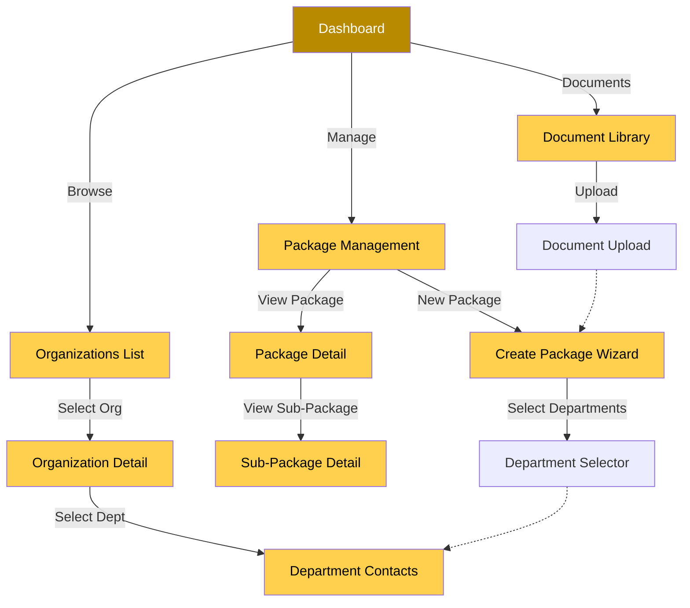

# Golden Pages - Unified Technical Specification
## Hierarchical Navigation & Package Management System

---

## Executive Summary

This unified specification covers two interconnected systems for Golden Pages:

1. **Hierarchical Navigation Layer** (Foundation) - Organizations → Departments → Contacts structure
2. **Package Management Layer** (Feature) - Document packages sent to departments with tracking

```
┌─────────────────────────────────────────────────────────────────────────────┐
│                         COMPLETE SYSTEM ARCHITECTURE                        │
├─────────────────────────────────────────────────────────────────────────────┤
│                                                                             │
│  ┌─────────────────────────────────────────────────────────────────────┐   │
│  │                    LAYER 1: FOUNDATION                              │   │
│  │              Hierarchical Navigation System                          │   │
│  │                                                                     │   │
│  │  ┌──────────────┐     ┌──────────────┐     ┌──────────────┐        │   │
│  │  │Organization  │────▶│  Department  │────▶│   Contact    │        │   │
│  │  │              │     │              │     │              │        │   │
│  │  │ - name       │     │ - name       │     │ - fullName   │        │   │
│  │  │ - type       │     │ - code       │     │ - email      │        │   │
│  │  │ - location   │     │ - parentId   │     │ - phone      │        │   │
│  │  │ - departments│     │ - isActive   │     │ - channels   │        │   │
│  │  └──────────────┘     └──────────────┘     └──────────────┘        │   │
│  └─────────────────────────────────────────────────────────────────────┘   │
│                                    │                                       │
│                                    ▼                                       │
│  ┌─────────────────────────────────────────────────────────────────────┐   │
│  │                    LAYER 2: FEATURE                                 │   │
│  │                Package Management System                            │   │
│  │                                                                     │   │
│  │  ┌──────────────┐     ┌──────────────┐     ┌──────────────┐        │   │
│  │  │   Package    │────▶│Sub-Package   │────▶│  Document    │        │   │
│  │  │              │     │              │     │              │        │   │
│  │  │ - name       │     │ - name       │     │ - filename   │        │   │
│  │  │ - status     │     │ - deadline   │     │ - storage    │        │   │
│  │  │ - createdBy  │     │ - documents  │     │ - checksum   │        │   │
│  │  └──────────────┘     └──────────────┘     └──────────────┘        │   │
│  │         │                                                        │   │
│  │         ▼                                                        │   │
│  │  ┌──────────────────────────────────────────────────────────────┐  │   │
│  │  │           PackageRecipient (Departments)                    │  │   │
│  │  │           - deliveryStatus (sent, delivered, failed)        │  │   │
│  │  │           - sentAt, deliveredAt                             │  │   │
│  │  └──────────────────────────────────────────────────────────────┘  │   │
│  └─────────────────────────────────────────────────────────────────────┘   │
│                                                                             │
└─────────────────────────────────────────────────────────────────────────────┘
```

### Current State
- 64 organizations
- 1,028 contacts
- Departments stored as free-form strings in `Contact.department` field
- No separate Department model exists
- No package management capability

### Target State
- Proper Department model with hierarchical support
- Package management with sub-packages and document tracking
- Complete audit trail for compliance
- Row-Level Security for data protection

### Implementation Order (Critical Dependency)

**IMPORTANT: The Hierarchical Navigation Layer must be implemented FIRST.**

```
┌─────────────────────────────────────────────────────────────────────────────┐
│                          IMPLEMENTATION TIMELINE                             │
├─────────────────────────────────────────────────────────────────────────────┤
│                                                                              │
│  WEEK 1                    WEEK 2-5                  WEEK 6-11               │
│  ┌───────────┐            ┌──────────────┐          ┌──────────────┐       │
│  │ DATABASE   │            │ HIERARCHY    │          │  PACKAGES    │       │
│  │ MIGRATION  │───────────▶│ NAVIGATION   │──────────▶│ MANAGEMENT   │       │
│  │            │            │ LAYER        │          │ LAYER        │       │
│  └───────────┘            └──────────────┘          └──────────────┘       │
│                                                                              │
│  DEPENDENCY: Hierarchy Layer must complete before Package Layer begins       │
│                                                                              │
└─────────────────────────────────────────────────────────────────────────────┘
```

---

## Table of Contents

1. [Business Requirements](#1-business-requirements)
2. [Complete Database Schema](#2-complete-database-schema)
3. [RBAC & RLS Integration](#3-rbac--rls-integration)
4. [Page Structure & Routing](#4-page-structure--routing)
5. [Component Architecture](#5-component-architecture)
6. [Data Fetching Strategy](#6-data-fetching-strategy)
7. [File Storage Strategy](#7-file-storage-strategy)
8. [Migration Plan](#8-migration-plan)
9. [Implementation Roadmap](#9-implementation-roadmap)
10. [Performance Considerations](#10-performance-considerations)
11. [Security Considerations](#11-security-considerations)
12. [Testing Strategy](#12-testing-strategy)
13. [Glossary](#13-glossary)

---

## 1. Business Requirements

### 1.1 Core Use Cases

| Use Case | Description | Layer | Actors |
|----------|-------------|-------|--------|
| Browse Organizations | View organizations with department counts | Hierarchy | All Roles |
| View Departments | Browse departments within an organization | Hierarchy | All Roles |
| Create Department | Create/edit departments with hierarchy | Hierarchy | Admin, Editor |
| Manage Contacts | Add/edit contacts within departments | Hierarchy | Admin, Editor |
| Create Package | Create a new package with name and description | Packages | Admin, Editor |
| Add Sub-Packages | Add sub-packages with documents | Packages | Admin, Editor |
| Select Recipients | Select departments as package recipients | Packages | Admin, Editor |
| Send Package | Send package to selected departments | Packages | Admin, Editor |
| Track Replies | Track expected reply dates and responses | Packages | All Roles |
| Close Matter | Admin closes matter when complete | Packages | Admin |
| View History | View complete package history | Packages | All Roles |

### 1.2 User Stories

#### Hierarchical Navigation Stories
1. As a **User**, I want to browse organizations and see department counts so I can understand the structure.
2. As an **Editor**, I want to create departments with hierarchy so I can organize contacts properly.
3. As a **User**, I want to navigate from organization → department → contacts so I can find specific people.
4. As an **Admin**, I want to manage department hierarchy (parent/child) so I can reflect real organizational structures.

#### Package Management Stories
1. As an **Admin**, I want to create packages with multiple sub-packages so that I can send comprehensive document sets.
2. As an **Editor**, I want to select specific departments as recipients so that I can target the right audience.
3. As an **Editor**, I want to attach documents to sub-packages so that recipients receive all necessary materials.
4. As an **Admin**, I want to track expected reply dates so that I can follow up on overdue responses.
5. As a **User**, I want to view sent packages and their status so that I can stay informed.
6. As an **Admin**, I want to close matters when complete so that the system reflects accurate status.

### 1.3 Key Business Rules

1. **Department Hierarchy**: Departments can have parent-child relationships within the same organization
2. **Department Codes**: Each department has a unique code (e.g., "FIN-001") for package recipient identification
3. **Package Status Workflow**: DRAFT → PENDING → SENT → COMPLETED → CLOSED
4. **Sub-Package Independence**: Sub-packages within a package can have different deadlines and response statuses
5. **Department Recipients**: Only departments (not individual contacts) can be package recipients
6. **Matter Closure**: Only admins can close matters; all sub-packages must be responded to first
7. **Audit Trail**: All write operations must be logged with user and timestamp

---

## 2. Complete Database Schema

### 2.1 Entity Relationship Overview

```
┌─────────────────┐       ┌──────────────────┐       ┌─────────────────┐
│   organisations │       │   departments    │       │    contacts     │
│                 │───┬───│                  │───┬───│                 │
│ - id            │   │   │ - id             │   │   │ - id            │
│ - name          │   │   │ - name           │   │   │ - fullName      │
│ - type          │   │   │ - code           │   │   │ - departmentId──│───┘
│ - ...           │   │   │ - parentId       │   │   │ - ...           │
└─────────────────┘   │   │ - isActive       │   │   └─────────────────┘
                      │   │ - organisationId│───┘
                      │   └──────────────────┘
                      │
┌─────────────────┐   │
│   packages      │───┘
│                 │
│ - id            │───────────┐
│ - name          │           │
│ - status        │           │
└─────────────────┘           │
                              │
┌─────────────────┐           │
│  sub_packages   │───────────┘
│                 │
│ - id            │───────────┐
│ - packageId     │           │
│ - name          │           │
└─────────────────┘           │
                              │
┌─────────────────┐           │
│package_docs     │───────────┘
│                 │
│ - subPackageId  │
│ - documentId    │
└─────────────────┘
                              │
┌─────────────────┐           │
│   documents     │───────────┘
│                 │
│ - id            │
│ - filename      │
│ - storagePath   │
└─────────────────┘

┌─────────────────────────────────────────────────────────┐
│              package_recipients (Junction)              │
│                                                         │
│  - packageId ───────────────┐                           │
│  - departmentId ────────────┼───┐                       │
│  - deliveryStatus           │   │                       │
│  - sentAt, deliveredAt      │   │                       │
└─────────────────────────────┼───┼───────────────────────┘
                               │   │
                               │   └───► Departments (from above)
                               │
                               └───► Packages (from above)
```

### 2.2 Complete Prisma Schema

```prisma
// ============================================================================
// ORGANISATIONS TABLE (Existing - Enhanced)
// ============================================================================
model Organisation {
  id                  String              @id @default(uuid_generate_v4())
  name                String
  type                OrganisationType
  headOfficeCountry   Region              @relation("OrganisationCountry", fields: [headOfficeCountryId], references: [id])
  headOfficeCountryId String
  headOfficeCity      String?
  headOfficeAddress   String?
  headOfficePhone     String?
  headOfficeEmail     String?
  headOfficeWebsite   String?
  description         String?

  // Optional owner for multi-tenancy
  ownerId            String?
  owner              User?               @relation("OrgOwner", fields: [ownerId], references: [id])

  contacts            Contact[]
  departments         Department[]         @relation("DepartmentOrganisation")
  locations           OrganisationLocation[]
  notes               OrganisationNote[]
  createdAt           DateTime            @default(now())
  updatedAt           DateTime            @updatedAt

  @@map("organisations")
}

enum OrganisationType {
  GOVERNMENT
  CORPORATE
  DIPLOMATIC_MISSION
  INTERNATIONAL_ORGANIZATION
}

// ============================================================================
// DEPARTMENTS TABLE (NEW - Foundation for both systems)
// ============================================================================
model Department {
  id             String       @id @default(uuid_generate_v4())
  name           String
  code           String?      @unique           // e.g., "FIN-001"
  description    String?

  // Organisation relation
  organisation   Organisation @relation("DepartmentOrganisation", fields: [organisationId], references: [id], onDelete: Cascade)
  organisationId String

  // Hierarchical structure (parent-child departments)
  parentId       String?
  parent         Department?  @relation("DepartmentHierarchy", fields: [parentId], references: [id], onDelete: SetNull)
  children       Department[] @relation("DepartmentHierarchy")

  // Active status for filtering
  isActive       Boolean      @default(true)

  // Audit trail
  createdAt      DateTime     @default(now())
  createdBy      String?
  updatedAt      DateTime     @updatedAt
  updatedBy      String?

  // Relations
  contacts       Contact[]
  packageRecipients PackageRecipient[]

  @@unique([organisationId, name])
  @@index([organisationId])
  @@index([parentId])
  @@index([isActive])
  @@index([code])
  @@map("departments")
}

// ============================================================================
// CONTACTS TABLE (Existing - Enhanced with department relation)
// ============================================================================
model Contact {
  id                String                @id @default(uuid_generate_v4())
  fullName          String
  roleTitle         String?

  // Department relation (NEW)
  department        Department?            @relation("ContactDepartment", fields: [departmentId], references: [id])
  departmentId      String?

  // Legacy field for migration
  departmentLegacy  String?               @map("department_legacy")

  // Organisation relation
  organisation      Organisation          @relation(fields: [organisationId], references: [id])
  organisationId    String
  primaryLocation   OrganisationLocation? @relation(fields: [primaryLocationId], references: [id])
  primaryLocationId String?

  // Optional owner for multi-tenancy
  ownerId           String?
  owner             User?                 @relation("ContactOwner", fields: [ownerId], references: [id])

  isHeadOfficeBased Boolean              @default(false)
  contactChannels   ContactChannel[]
  notes             ContactNote[]
  outreachLogs      OutreachLog[]
  createdAt         DateTime              @default(now())
  updatedAt         DateTime              @updatedAt

  @@index([organisationId])
  @@index([departmentId])
  @@map("contacts")
}

// ============================================================================
// PACKAGES TABLE (NEW - Package Management)
// ============================================================================
model Package {
  id            String        @id @default(uuid_generate_v4())
  name          String        @db.VarChar(255)
  description   String?       @db.Text

  // Status tracking
  status        PackageStatus @default(DRAFT)

  // Matter closure
  closedAt      DateTime?     @map("closed_at")
  closedBy      String?       @map("closed_by")

  // Audit
  createdAt     DateTime      @default(now()) @map("created_at")
  createdBy     String        @map("created_by")
  updatedAt     DateTime      @updatedAt @map("updated_at")
  updatedBy     String?       @map("updated_by")

  // Relations
  creator       User          @relation("PackageCreator", fields: [createdBy], references: [id])
  closer        User?         @relation("PackageCloser", fields: [closedBy], references: [id])

  subPackages   SubPackage[]
  recipients    PackageRecipient[]

  @@index([status])
  @@index([createdBy])
  @@index([closedAt])
  @@map("packages")
}

enum PackageStatus {
  DRAFT       // Being created
  PENDING     // Ready to send
  SENT        // Fully sent to all recipients
  PARTIAL     // Partially sent
  COMPLETED   // All sub-packages responded
  CLOSED      // Matter closed by admin
  CANCELLED   // Cancelled
}

// ============================================================================
// SUB-PACKAGES TABLE (NEW - Package Management)
// ============================================================================
model SubPackage {
  id            String    @id @default(uuid_generate_v4())
  packageId     String    @map("package_id")
  name          String    @db.VarChar(255)
  description   String?   @db.Text
  sequence      Int       @default(0)

  // Reply tracking
  expectedReply DateTime? @map("expected_reply")
  actualReply   DateTime? @map("actual_reply")

  // Status
  status        SubPackageStatus @default(DRAFT)
  sentAt        DateTime? @map("sent_at")

  // Audit
  createdAt     DateTime  @default(now()) @map("created_at")
  createdBy     String    @map("created_by")
  updatedAt     DateTime  @updatedAt @map("updated_at")
  updatedBy     String?   @map("updated_by")

  // Relations
  package       Package   @relation(fields: [packageId], references: [id], onDelete: Cascade)
  creator       User      @relation("SubPackageCreator", fields: [createdBy], references: [id])

  documents     PackageDocument[]
  responses     SubPackageResponse[]

  @@index([packageId])
  @@index([status])
  @@index([expectedReply])
  @@map("sub_packages")
}

enum SubPackageStatus {
  DRAFT     // Being created
  READY     // Ready to send
  SENT      // Sent to recipients
  RESPONDED // Response received
  OVERDUE   // Past expected reply without response
  CANCELLED // Cancelled
}

// ============================================================================
// DOCUMENTS TABLE (NEW - Package Management)
// ============================================================================
model Document {
  id            String   @id @default(uuid_generate_v4())
  filename      String   @db.VarChar(255)
  originalName  String   @map("original_name") @db.VarChar(255)
  mimeType      String   @map("mime_type") @db.VarChar(100)
  sizeBytes     Int      @map("size_bytes")
  storagePath   String   @map("storage_path") @db.VarChar(500)
  checksum      String?  @db.VarChar(64)

  description   String?  @db.Text
  category      DocumentCategory? @default(OTHER)

  createdAt     DateTime @default(now()) @map("created_at")
  createdBy     String   @map("created_by")

  // Relations
  creator       User     @relation("DocumentCreator", fields: [createdBy], references: [id])
  attachments   PackageDocument[]

  @@index([createdBy])
  @@index([category])
  @@map("documents")
}

enum DocumentCategory {
  NOTICE
  FORM
  CERTIFICATE
  CORRESPONDENCE
  REPORT
  OTHER
}

// ============================================================================
// PACKAGE DOCUMENTS (Junction Table)
// ============================================================================
model PackageDocument {
  id            String   @id @default(uuid_generate_v4())
  subPackageId  String   @map("sub_package_id")
  documentId    String   @map("document_id")

  attachedAt    DateTime @default(now()) @map("attached_at")
  attachedBy    String   @map("attached_by")
  description   String?  @db.Text

  // Relations
  subPackage    SubPackage @relation(fields: [subPackageId], references: [id], onDelete: Cascade)
  document      Document   @relation(fields: [documentId], references: [id], onDelete: Cascade)

  @@unique([subPackageId, documentId])
  @@index([subPackageId])
  @@map("package_documents")
}

// ============================================================================
// PACKAGE RECIPIENTS (Which departments received which packages)
// ============================================================================
model PackageRecipient {
  id            String         @id @default(uuid_generate_v4())
  packageId     String         @map("package_id")
  departmentId  String         @map("department_id")

  // Delivery tracking
  deliveryStatus DeliveryStatus @default(PENDING)
  sentAt        DateTime?      @map("sent_at")
  deliveredAt   DateTime?      @map("delivered_at")

  // Recipient snapshot
  recipientName String?        @map("recipient_name")
  recipientEmail String?       @map("recipient_email")

  notes         String?        @db.Text

  createdAt     DateTime       @default(now()) @map("created_at")
  createdBy     String         @map("created_by")

  // Relations
  package       Package        @relation(fields: [packageId], references: [id], onDelete: Cascade)
  department    Department     @relation(fields: [departmentId], references: [id], onDelete: Cascade)

  @@unique([packageId, departmentId])
  @@index([packageId])
  @@index([departmentId])
  @@index([deliveryStatus])
  @@map("package_recipients")
}

enum DeliveryStatus {
  PENDING     // Not yet sent
  SENDING     // In progress
  SENT        // Sent successfully
  DELIVERED   // Confirmed delivery
  FAILED      // Send failed
  BOUNCED     // Email bounced
}

// ============================================================================
// SUB-PACKAGE RESPONSES (Track responses from departments)
// ============================================================================
model SubPackageResponse {
  id            String   @id @default(uuid_generate_v4())
  subPackageId  String   @map("sub_package_id")
  departmentId  String   @map("department_id")

  responseDate  DateTime @map("response_date")
  status        ResponseStatus @default(RECEIVED)
  notes         String?  @db.Text

  documentIds   String[] @map("document_ids")

  createdAt     DateTime @default(now()) @map("created_at")
  createdBy     String   @map("created_by")

  // Relations
  subPackage    SubPackage @relation(fields: [subPackageId], references: [id], onDelete: Cascade)

  @@index([subPackageId])
  @@index([departmentId])
  @@map("sub_package_responses")
}

enum ResponseStatus {
  RECEIVED
  REVIEWING
  ACCEPTED
  REJECTED
  INCOMPLETE
}

// ============================================================================
// USER MODEL (Extended with package relations)
// ============================================================================
model User {
  id              String       @id @default(uuid_generate_v4())

  // ... existing fields ...

  // Package relations
  createdPackages    Package[]       @relation("PackageCreator")
  closedPackages     Package[]       @relation("PackageCloser")
  createdSubPackages SubPackage[]    @relation("SubPackageCreator")
  uploadedDocuments  Document[]      @relation("DocumentCreator")
}
```

### 2.3 Schema Migration Summary

| Table | Type | Description |
|-------|------|-------------|
| `organisations` | Existing - Enhanced | Added `departments` relation |
| `departments` | **NEW** | Core foundation model |
| `contacts` | Existing - Enhanced | Added `departmentId` foreign key |
| `packages` | **NEW** | Main package entity |
| `sub_packages` | **NEW** | Individual notices within packages |
| `documents` | **NEW** | File storage metadata |
| `package_documents` | **NEW** | Junction: documents ↔ sub-packages |
| `package_recipients` | **NEW** | Junction: packages ↔ departments |
| `sub_package_responses` | **NEW** | Response tracking |

---

## 3. RBAC & RLS Integration

### 3.1 Unified Permission Matrix

| Permission | Description | Admin | Editor | User | Used By |
|------------|-------------|-------|--------|------|---------|
| `org:read` | View organizations | ✅ | ✅ | ✅ | Both |
| `org:write` | Create/edit organizations | ✅ | ✅ | ❌ | Both |
| `department:read` | View departments | ✅ | ✅ | ✅ | Both |
| `department:write` | Create/edit departments | ✅ | ✅ | ❌ | Both |
| `contact:read` | View contacts | ✅ | ✅ | ✅ | Both |
| `contact:write` | Create/edit contacts | ✅ | ✅ | ❌ | Both |
| `contact:archive` | Soft delete contacts | ✅ | ✅ | ❌ | Both |
| `package:read` | View packages | ✅ | ✅ | ✅ | Packages |
| `package:write` | Create/edit packages | ✅ | ✅ | ❌ | Packages |
| `package:delete` | Delete packages | ✅ | ❌ | ❌ | Packages |
| `package:send` | Send packages | ✅ | ✅ | ❌ | Packages |
| `package:close` | Close matters | ✅ | ❌ | ❌ | Packages |
| `document:read` | View documents | ✅ | ✅ | ✅ | Packages |
| `document:write` | Upload/manage documents | ✅ | ✅ | ❌ | Packages |
| `document:delete` | Delete documents | ✅ | ❌ | ❌ | Packages |

### 3.2 RLS Policies

```sql
-- ============================================================================
-- DEPARTMENTS TABLE RLS
-- ============================================================================
ALTER TABLE departments ENABLE ROW LEVEL SECURITY;

-- Read: Users with org:read or department:read
CREATE POLICY "departments_select_read_permission"
ON departments FOR SELECT
TO authenticated
USING (
  has_permission(auth.uid(), 'department:read') OR
  has_permission(auth.uid(), 'org:read')
);

-- Write: Users with department:write or org:write
CREATE POLICY "departments_insert_write_permission"
ON departments FOR INSERT
TO authenticated
WITH CHECK (
  has_permission(auth.uid(), 'department:write') OR
  has_permission(auth.uid(), 'org:write')
);

CREATE POLICY "departments_update_write_permission"
ON departments FOR UPDATE
TO authenticated
USING (
  has_permission(auth.uid(), 'department:write') OR
  has_permission(auth.uid(), 'org:write')
);

-- Delete: Admins only
CREATE POLICY "departments_delete_admin_permission"
ON departments FOR DELETE
TO authenticated
USING (has_role(auth.uid(), 'admin'));

-- ============================================================================
-- PACKAGES TABLE RLS
-- ============================================================================
ALTER TABLE packages ENABLE ROW LEVEL SECURITY;

CREATE POLICY "packages_select_read_permission"
ON packages FOR SELECT
TO authenticated
USING (
  has_permission(auth.uid(), 'package:read') OR
  created_by = auth.uid()
);

CREATE POLICY "packages_insert_write_permission"
ON packages FOR INSERT
TO authenticated
WITH CHECK (has_permission(auth.uid(), 'package:write'));

CREATE POLICY "packages_update_write_permission"
ON packages FOR UPDATE
TO authenticated
USING (
  has_permission(auth.uid(), 'package:write') OR
  created_by = auth.uid()
);

CREATE POLICY "packages_delete_admin_permission"
ON packages FOR DELETE
TO authenticated
USING (has_permission(auth.uid(), 'package:delete'));

-- ============================================================================
-- DOCUMENTS TABLE RLS
-- ============================================================================
ALTER TABLE documents ENABLE ROW LEVEL SECURITY;

CREATE POLICY "documents_select_read_permission"
ON documents FOR SELECT
TO authenticated
USING (
  has_permission(auth.uid(), 'document:read') OR
  created_by = auth.uid()
);

CREATE POLICY "documents_insert_write_permission"
ON documents FOR INSERT
TO authenticated
WITH CHECK (has_permission(auth.uid(), 'document:write'));

CREATE POLICY "documents_delete_admin_permission"
ON documents FOR DELETE
TO authenticated
USING (has_permission(auth.uid(), 'document:delete'));

-- ============================================================================
-- SUB-PACKAGES TABLE RLS
-- ============================================================================
ALTER TABLE sub_packages ENABLE ROW LEVEL SECURITY;

CREATE POLICY "sub_packages_select_read_permission"
ON sub_packages FOR SELECT
TO authenticated
USING (
  has_permission(auth.uid(), 'package:read') OR
  created_by = auth.uid()
);

CREATE POLICY "sub_packages_insert_write_permission"
ON sub_packages FOR INSERT
TO authenticated
WITH CHECK (has_permission(auth.uid(), 'package:write'));

-- ============================================================================
-- CONTACTS TABLE RLS (Updated for department access)
-- ============================================================================
CREATE POLICY "contacts_select_by_department_access"
ON contacts FOR SELECT
TO authenticated
USING (
  has_permission(auth.uid(), 'contact:read')
);
```

### 3.3 Activity Logging

All operations log to `activity_logs`:

| Layer | Action | Resource Type |
|-------|--------|---------------|
| **Hierarchy** | `department.created` | `department` |
| **Hierarchy** | `department.updated` | `department` |
| **Hierarchy** | `department.deleted` | `department` |
| **Hierarchy** | `contact.created` | `contact` |
| **Packages** | `package.created` | `package` |
| **Packages** | `package.updated` | `package` |
| **Packages** | `package.sent` | `package` |
| **Packages** | `package.closed` | `package` |
| **Packages** | `sub_package.created` | `sub_package` |
| **Packages** | `sub_package.responded` | `sub_package` |
| **Packages** | `document.uploaded` | `document` |

---

## 4. Page Structure & Routing

### 4.1 Complete Route Structure

```
/                                          (Dashboard - existing)
│
├── /organizations                          (Hierarchical Navigation)
│   ├── /organizations                     (Organizations list - NEW)
│   ├── /organizations/[id]                (Organization detail - NEW)
│   └── /organizations/[id]/departments/[deptId]  (Department contacts - NEW)
│
├── /packages                              (Package Management)
│   ├── /packages                          (Package list - NEW)
│   ├── /packages/new                      (Create package wizard - NEW)
│   ├── /packages/[id]                     (Package detail - NEW)
│   ├── /packages/[id]/edit                (Edit package - NEW)
│   └── /packages/[id]/sub/[subId]         (Sub-package detail - NEW)
│
├── /documents                             (Document Library - NEW)
│   ├── /documents                         (Document browser - NEW)
│   └── /documents/upload                  (Upload modal - NEW)
│
├── /directory                             (Legacy directory - existing)
└── /admin                                 (Admin panel - existing)
```

### 4.2 Navigation Flow Diagram



### 4.3 Route Descriptions

#### Hierarchical Navigation Routes

| Route | Purpose | Component |
|--------|---------|------------|
| `/organizations` | List all organizations with department counts | `OrganizationsList` |
| `/organizations/[id]` | Organization detail with department list | `OrganizationDetail` |
| `/organizations/[id]/departments/[deptId]` | Contacts within a specific department | `DepartmentContacts` |

#### Package Management Routes

| Route | Purpose | Component |
|--------|---------|------------|
| `/packages` | Package management dashboard | `PackageList` |
| `/packages/new` | Create new package wizard | `CreatePackageWizard` |
| `/packages/[id]` | Package detail view | `PackageDetail` |
| `/packages/[id]/edit` | Edit existing package | `EditPackage` |
| `/packages/[id]/sub/[subId]` | Sub-package detail | `SubPackageDetail` |

#### Document Routes

| Route | Purpose | Component |
|--------|---------|------------|
| `/documents` | Document library browser | `DocumentLibrary` |
| `/documents/upload` | Upload document modal | `DocumentUpload` |

---

## 5. Component Architecture

### 5.1 Complete Component Structure

```
app/
├── layout.tsx                              (Root layout)
├── page.tsx                                (Dashboard)
│
├── organizations/                          (Hierarchical Navigation)
│   ├── page.tsx                            (OrganizationsList)
│   └── [id]/
│       ├── page.tsx                        (OrganizationDetail)
│       └── departments/
│           └── [deptId]/
│               └── page.tsx                (DepartmentContacts)
│
├── packages/                               (Package Management)
│   ├── page.tsx                            (PackageList)
│   ├── new/page.tsx                        (CreatePackageWizard)
│   └── [id]/
│       ├── page.tsx                        (PackageDetail)
│       ├── edit/page.tsx                   (EditPackage)
│       └── sub/
│           └── [subId]/
│               └── page.tsx                (SubPackageDetail)
│
└── documents/                              (Document Library)
    ├── page.tsx                            (DocumentLibrary)
    └── upload/page.tsx                     (DocumentUpload)

components/
├── shared/                                 (Shared Components)
│   ├── BreadcrumbNav.tsx
│   ├── LoadingSpinner.tsx
│   ├── EmptyState.tsx
│   ├── ErrorBoundary.tsx
│   ├── FileDropzone.tsx
│   ├── StatusBadge.tsx
│   └── Timeline.tsx
│
├── hierarchy/                              (Hierarchical Navigation)
│   ├── OrganizationsList.tsx
│   ├── OrganizationCard.tsx
│   ├── DepartmentList.tsx
│   ├── DepartmentCard.tsx
│   ├── DepartmentTree.tsx                  (Hierarchical view)
│   ├── DepartmentSelector.tsx              (Multi-select with search)
│   ├── ContactList.tsx
│   └── ContactCard.tsx
│
├── packages/                               (Package Management)
│   ├── PackageList.tsx
│   ├── PackageCard.tsx
│   ├── PackageForm.tsx
│   ├── PackageDetail.tsx
│   ├── PackageSendWizard.tsx               (Multi-step wizard)
│   ├── PackageStatusBadge.tsx
│   ├── SubPackageList.tsx
│   ├── SubPackageForm.tsx
│   ├── SubPackageCard.tsx
│   ├── SubPackageDetail.tsx
│   ├── RecipientSelector.tsx               (Department selector)
│   ├── ResponseTracker.tsx
│   └── PackageTimeline.tsx
│
└── documents/                              (Document Management)
    ├── DocumentLibrary.tsx
    ├── DocumentUploader.tsx
    ├── DocumentCard.tsx
    └── DocumentPreview.tsx
```

### 5.2 Key Component Specifications

#### RecipientSelector Component (Critical Integration Point)

This component is where the hierarchical navigation system connects to package management:

```typescript
// components/packages/RecipientSelector.tsx
interface RecipientSelectorProps {
  selectedDepartmentIds: string[];
  onSelectionChange: (ids: string[]) => void;
  organisationId?: string;  // Filter by org
  allowHierarchy?: boolean; // Allow selecting parent + all children
}

function RecipientSelector({
  selectedDepartmentIds,
  onSelectionChange,
  organisationId,
  allowHierarchy = true
}: RecipientSelectorProps) {
  // Fetch departments with hierarchical structure
  const { data: departments } = useDepartments({ organisationId });

  // Build tree structure from flat department list
  const departmentTree = buildDepartmentTree(departments);

  return (
    <div className="recipient-selector">
      <DepartmentTree
        tree={departmentTree}
        selectedIds={selectedDepartmentIds}
        onSelect={onSelectionChange}
        allowHierarchySelect={allowHierarchy}
        showContactCount
        showCode
      />
    </div>
  );
}
```

#### OrganizationsList Component

```typescript
// components/hierarchy/OrganizationsList.tsx
interface OrganizationsListProps {
  organizations: OrganizationWithDeptCount[];
  loading: boolean;
  error?: Error;
}

interface OrganizationWithDeptCount extends Organization {
  departmentCount: number;
  contactCount: number;
}
```

**Features:**
- Search/filter by organization name
- Filter by organization type
- Sort by name, type, or contact count
- Display department count per organization
- Pagination (20 organizations per page)

#### DepartmentTree Component

```typescript
// components/hierarchy/DepartmentTree.tsx
interface DepartmentTreeProps {
  tree: DepartmentNode[];
  selectedIds: string[];
  onSelect: (ids: string[]) => void;
  allowHierarchySelect?: boolean;
  showContactCount?: boolean;
  showCode?: boolean;
}

interface DepartmentNode {
  id: string;
  name: string;
  code?: string;
  contactCount?: number;
  children?: DepartmentNode[];
}
```

---

## 6. Data Fetching Strategy

### 6.1 Service Layer

```typescript
// ============================================================================
// HIERARCHY SERVICE (Foundation Layer)
// ============================================================================
export class HierarchyService {
  /**
   * Get organizations with department counts
   */
  async getOrganizations(): Promise<OrganizationWithDeptCount[]> {
    const { data } = await supabase
      .from('organisations')
      .select(`
        *,
        departments(count),
        contacts(count)
      `)
      .order('name');

    return data.map(org => ({
      ...org,
      departmentCount: org.departments?.[0]?.count || 0,
      contactCount: org.contacts?.[0]?.count || 0
    }));
  }

  /**
   * Get departments for an organization (with hierarchy)
   */
  async getDepartments(organisationId: string): Promise<DepartmentTree[]> {
    const { data } = await supabase
      .from('departments')
      .select(`
        *,
        contacts(count),
        parent:parent_department(*)
      `)
      .eq('organisationId', organisationId)
      .eq('isActive', true)
      .order('name');

    return buildDepartmentTree(data);
  }

  /**
   * Get contacts for a specific department
   */
  async getDepartmentContacts(departmentId: string) {
    const { data: contacts } = await supabase
      .from('contacts')
      .select(`
        *,
        contact_channels(*)
      `)
      .eq('departmentId', departmentId)
      .order('fullName');

    return contacts;
  }
}

// ============================================================================
// PACKAGE SERVICE (Feature Layer - depends on Hierarchy)
// ============================================================================
export class PackageService {
  /**
   * Create package with departments from hierarchy
   */
  async createPackage(input: CreatePackageInput, userId: string) {
    // Create package
    const { data: package } = await supabase
      .from('packages')
      .insert({
        name: input.name,
        description: input.description,
        status: 'DRAFT',
        createdBy: userId,
      })
      .select()
      .single();

    // Add recipients (departments from hierarchy)
    const recipients = input.recipientDepartmentIds.map(deptId => ({
      packageId: package.id,
      departmentId: deptId,
      createdBy: userId,
    }));

    await supabase.from('package_recipients').insert(recipients);

    // Create sub-packages with documents
    for (const subInput of input.subPackages) {
      await this.createSubPackage(package.id, subInput, userId);
    }

    return package;
  }

  /**
   * Send package to selected departments
   */
  async sendPackage(packageId: string, userId: string) {
    // Get package with recipients and department info
    const { data: package } = await supabase
      .from('packages')
      .select(`
        *,
        recipients(
          *,
          department:departments(*)
        )
      `)
      .eq('id', packageId)
      .single();

    // Update recipient status
    await supabase
      .from('package_recipients')
      .update({
        deliveryStatus: 'SENT',
        sentAt: new Date().toISOString(),
      })
      .eq('packageId', packageId);

    // Update package status
    await supabase
      .from('packages')
      .update({ status: 'SENT' })
      .eq('id', packageId);

    // Log activity
    await this.logActivity('package.sent', packageId, userId);
  }
}
```

### 6.2 React Hooks

```typescript
// hooks/useHierarchy.ts
export function useDepartments(filters?: { organisationId?: string }) {
  return useQuery({
    queryKey: ['departments', filters],
    queryFn: () => hierarchyService.getDepartments(filters?.organisationId),
  });
}

// hooks/usePackages.ts
export function usePackages(filters?: PackageFilters) {
  return useQuery({
    queryKey: ['packages', filters],
    queryFn: () => packageService.getPackages(filters),
  });
}

export function useCreatePackage() {
  const queryClient = useQueryClient();
  const { user } = useAuth();

  return useMutation({
    mutationFn: (input: CreatePackageInput) =>
      packageService.createPackage(input, user.id),
    onSuccess: () => {
      queryClient.invalidateQueries({ queryKey: ['packages'] });
    },
  });
}
```

---

## 7. File Storage Strategy

### 7.1 Supabase Storage Structure

```
packages-storage/
├── documents/
│   ├── {year}/
│   │   ├── {month}/
│   │   │   └── {uuid}.{ext}
│   └── thumbnails/
│       └── {uuid}_thumb.png
└── exports/
    └── {year}/
        └── {month}/
            └── package-{package_uuid}.zip
```

### 7.2 Storage Service

```typescript
export class PackageStorageService {
  private static instance: PackageStorageService;
  private readonly BUCKET_NAME = 'packages-storage';

  async uploadDocument(file: File, userId: string): Promise<string> {
    const now = new Date();
    const path = `documents/${now.getFullYear()}/${String(now.getMonth() + 1).padStart(2, '0')}/${crypto.randomUUID()}.${file.name.split('.').pop()}`;

    const { data, error } = await supabase.storage
      .from(this.BUCKET_NAME)
      .upload(path, file);

    if (error) throw error;

    // Generate thumbnail for PDFs
    if (file.type === 'application/pdf') {
      await this.generateThumbnail(path);
    }

    return path;
  }

  private async generateThumbnail(documentPath: string): Promise<void> {
    await supabase.functions.invoke('generate-pdf-thumbnail', {
      body: { documentPath },
    });
  }
}
```

### 7.3 Edge Function (PDF Thumbnail)

```typescript
// supabase/functions/generate-pdf-thumbnail/index.ts
import { serve } from 'https://deno.land/std@0.168.0/http/server.ts';

serve(async (req) => {
  const { documentPath, fileId } = await req.json();

  // Use pdftocairo to generate PNG thumbnail
  // Upload thumbnail to thumbnails/ folder

  return new Response(
    JSON.stringify({ success: true, thumbnailPath: `thumbnails/${fileId}_thumb.png` }),
    { headers: { 'Content-Type': 'application/json' } }
  );
});
```

---

## 8. Migration Plan

### 8.1 Migration Overview

This migration will:
1. Add the `Department` model
2. Update `Contact` model to reference departments
3. Add package management tables
4. Migrate existing department strings to proper department records
5. Update RLS policies

### 8.2 Step 1: Schema Changes

```bash
# Run Prisma migration
npx prisma migrate dev --name add_unified_schema
```

### 8.3 Step 2: Department Migration Script

```typescript
// scripts/migrate-departments.ts
async function migrateDepartments() {
  console.log('🚀 Starting department migration...');

  // Get all contacts with non-null departments
  const { data: contacts } = await supabase
    .from('contacts')
    .select('id, organisationId, department')
    .not('department', 'is', null);

  // Group by organization and department
  const deptMap = new Map<string, DepartmentRecord>();
  const contactDeptMap = new Map<string, string>();

  for (const contact of contacts) {
    const key = `${contact.organisationId}:${contact.department}`;

    if (!deptMap.has(key)) {
      deptMap.set(key, {
        id: crypto.randomUUID(),
        name: contact.department,
        organisationId: contact.organisationId,
        code: generateDepartmentCode(contact.department),
        isActive: true,
      });
    }

    contactDeptMap.set(contact.id, deptMap.get(key)!.id);
  }

  // Create departments in batches
  const departments = Array.from(deptMap.values());
  for (let i = 0; i < departments.length; i += 100) {
    await supabase
      .from('departments')
      .insert(departments.slice(i, i + 100));
  }

  // Update contacts with department IDs
  for (const [contactId, deptId] of contactDeptMap) {
    await supabase
      .from('contacts')
      .update({ departmentId: deptId })
      .eq('id', contactId);
  }

  console.log('✅ Migration completed!');
}
```

### 8.4 Rollback Plan

```typescript
// scripts/rollback.ts
async function rollback() {
  // Restore legacy department field
  await supabase
    .from('contacts')
    .update({
      department: supabase.raw('department_legacy'),
      departmentId: null
    });

  // Delete package tables
  await supabase.from('sub_package_responses').delete().neq('id', '00000000-0000-0000-0000-000000000000');
  await supabase.from('package_recipients').delete().neq('id', '00000000-0000-0000-0000-000000000000');
  await supabase.from('package_documents').delete().neq('id', '00000000-0000-0000-0000-000000000000');
  await supabase.from('sub_packages').delete().neq('id', '00000000-0000-0000-0000-000000000000');
  await supabase.from('packages').delete().neq('id', '00000000-0000-0000-0000-000000000000');
  await supabase.from('documents').delete().neq('id', '00000000-0000-0000-0000-000000000000');
  await supabase.from('departments').delete().neq('id', '00000000-0000-0000-0000-000000000000');

  console.log('✅ Rollback completed');
}
```

---

## 9. Implementation Roadmap

### 9.1 Unified Timeline (12 Weeks)

```
┌─────────────────────────────────────────────────────────────────────────────┐
│                          IMPLEMENTATION TIMELINE                             │
├─────────────────────────────────────────────────────────────────────────────┤
│                                                                              │
│  WEEK 1                    WEEK 2-5                  WEEK 6-12               │
│  ┌───────────┐            ┌──────────────┐          ┌──────────────┐       │
│  │ DATABASE   │            │ HIERARCHY    │          │  PACKAGES    │       │
│  │ MIGRATION  │───────────▶│ NAVIGATION   │──────────▶│ MANAGEMENT   │       │
│  │            │            │ LAYER        │          │ LAYER        │       │
│  └───────────┘            └──────────────┘          └──────────────┘       │
│                                                                              │
│  DEPENDENCY: Hierarchy Layer must complete before Package Layer begins       │
│                                                                              │
└─────────────────────────────────────────────────────────────────────────────┘
```

### 9.2 Phase 0: Database Foundation (Week 1)

| Task | Description | Status |
|------|-------------|--------|
| 0.1 | Backup production database | ⬜ |
| 0.2 | Run Prisma migration for all tables | ⬜ |
| 0.3 | Execute department migration script | ⬜ |
| 0.4 | Create Supabase Storage bucket | ⬜ |
| 0.5 | Configure storage RLS policies | ⬜ |
| 0.6 | Add new permissions to database | ⬜ |
| 0.7 | Create all RLS policies | ⬜ |
| 0.8 | Test rollback in staging | ⬜ |

### 9.3 Phase 1: Hierarchy Layer (Week 2-5)

| Week | Tasks |
|------|-------|
| **Week 2** | - Create `/organizations` routes<br>- Implement `OrganizationsList` component<br>- Implement `OrganizationDetail` component<br>- Implement `DepartmentList` component |
| **Week 3** | - Implement `DepartmentContacts` component<br>- Create `HierarchyService` class<br>- Implement data fetching hooks<br>- Add caching strategy |
| **Week 4** | - Create `DepartmentTree` component<br>- Implement `DepartmentSelector` component<br>- Add search/filter functionality<br>- Update Sidebar navigation |
| **Week 5** | - Integration testing<br>- RBAC permission testing<br>- Performance testing<br>- Bug fixes |

### 9.4 Phase 2: Package Layer (Week 6-11)

| Week | Tasks |
|------|-------|
| **Week 6** | - Create `/packages` routes<br>- Implement `PackageList` component<br>- Implement `PackageForm` component<br>- Implement `RecipientSelector` (uses departments) |
| **Week 7** | - Implement `PackageSendWizard` component<br>- Create `PackageService` class<br>- Implement document upload flow<br>- Create `DocumentUploader` component |
| **Week 8** | - Implement `PackageDetail` component<br>- Implement `SubPackageForm` component<br>- Implement `ResponseTracker` component<br>- Add activity timeline |
| **Week 9** | - Create `DocumentLibrary` component<br>- Implement package send workflow<br>- Add email notification system<br>- Create PDF thumbnail Edge Function |
| **Week 10** | - Integration testing<br>- End-to-end workflow testing<br>- RBAC permission testing<br>- Performance testing |
| **Week 11** | - Bug fixes<br>- User acceptance testing<br>- Documentation<br>- Deployment preparation |

### 9.5 Phase 3: Deployment (Week 12)

| Task | Description |
|------|-------------|
| 12.1 | Deploy to staging environment |
| 12.2 | Final user acceptance testing |
| 12.3 | Production deployment |
| 12.4 | Monitor and address issues |
| 12.5 | Remove `departmentLegacy` field (after 30 days) |

---

## 10. Performance Considerations

### 10.1 Database Indexes

```sql
-- Optimized indexes for both systems
CREATE INDEX idx_organisations_name ON organisations(name);
CREATE INDEX idx_departments_org_active ON departments(organisationId, isActive);
CREATE INDEX idx_departments_parent ON departments(parentId) WHERE parentId IS NOT NULL;
CREATE INDEX idx_contacts_department ON contacts(departmentId) WHERE departmentId IS NOT NULL;
CREATE INDEX idx_packages_status_created ON packages(status, createdAt DESC);
CREATE INDEX idx_sub_packages_expected ON sub_packages(expectedReply) WHERE status IN ('SENT', 'OVERDUE');
CREATE INDEX idx_package_recipients_status ON package_recipients(deliveryStatus);
```

### 10.2 Query Optimization

| Pattern | Description |
|---------|-------------|
| **Pagination** | Default 25 items per page for all list views |
| **Eager Loading** | Use Supabase `select()` with joins to avoid N+1 |
| **Caching** | Cache departments for 1 hour, packages for 10 minutes |
| **Materialized Views** | Dashboard statistics refreshed every 5 minutes |

### 10.3 Performance Targets

| Metric | Target |
|--------|--------|
| Organizations list load time | < 500ms |
| Organization detail load time | < 300ms |
| Department contacts load time | < 200ms |
| Package list load time | < 500ms |
| Package detail load time | < 300ms |
| Time to interactive | < 2s |
| First contentful paint | < 1s |

### 10.4 File Upload Optimization

- Maximum file size: 25MB
- Chunked uploads for files > 5MB
- Thumbnail generation via Edge Function
- Compress thumbnails to max 200KB

---

## 11. Security Considerations

### 11.1 File Upload Security

| Measure | Implementation |
|---------|----------------|
| Type validation | Client + server MIME type check |
| Size limits | 25MB max per file |
| Malware scanning | ClamAV via Edge Function (optional) |
| Path traversal prevention | UUID filenames only |
| Storage RLS | Per-document access control |

### 11.2 Data Privacy

- All tables use Row Level Security
- Audit trail for all write operations
- Document access logged
- Department PII protected by RLS

### 11.3 Access Control Matrix

| Resource | Create | Read | Update | Delete |
|----------|--------|------|--------|--------|
| Organization | Admin/Editor | All | Admin/Editor | Admin |
| Department | Admin/Editor | All | Admin/Editor | Admin |
| Contact | Admin/Editor | All | Admin/Editor | Admin/Editor |
| Package | Admin/Editor | All | Creator/Admin | Admin |
| Document | Admin/Editor | All | Creator/Admin | Admin |

---

## 12. Testing Strategy

### 12.1 Unit Tests

```typescript
// Hierarchy Service Tests
describe('HierarchyService', () => {
  it('builds department tree from flat list', () => {
    const depts = [
      { id: '1', name: 'Finance', parentId: null },
      { id: '2', name: 'Accounts Payable', parentId: '1' },
    ];
    const tree = hierarchyService.buildTree(depts);
    expect(tree[0].children[0].name).toBe('Accounts Payable');
  });
});

// Package Service Tests
describe('PackageService', () => {
  it('creates package with department recipients', async () => {
    const pkg = await packageService.createPackage({
      name: 'Test Package',
      recipientDepartmentIds: ['dept-1', 'dept-2'],
      subPackages: [],
    }, 'user-1');
    expect(pkg.recipients).toHaveLength(2);
  });
});
```

### 12.2 Integration Tests

```typescript
describe('Package Send Flow', () => {
  it('sends package to departments and updates status', async () => {
    const pkg = await createTestPackage();
    await packageService.sendPackage(pkg.id, 'admin-user');

    const recipients = await supabase
      .from('package_recipients')
      .select('*')
      .eq('packageId', pkg.id);

    expect(recipients.data.every(r => r.deliveryStatus === 'SENT')).toBe(true);
  });
});
```

### 12.3 E2E Tests

```typescript
test('complete package workflow', async ({ page }) => {
  await page.goto('/login');
  await page.fill('[name="email"]', 'admin@example.com');
  await page.click('button[type="submit"]');

  await page.goto('/packages/new');
  await page.fill('[name="name"]', 'Test Package');
  await page.click('text=Add Recipients');
  await page.click('[data-dept-id="dept-finance"]');
  await page.click('text=Add Department');

  await page.click('text=Add Sub-Package');
  await page.fill('[name="subName"]', 'Notice One');
  await page.setInputFiles('input[type="file"]', 'test.pdf');
  await page.click('text=Send Package');

  await expect(page.locator('text=Package sent successfully')).toBeVisible();
});
```

---

## 13. Glossary

| Term | Definition |
|------|------------|
| **Organization** | Top-level entity (government, corporate, diplomatic mission) |
| **Department** | Organizational unit within an organization; can have sub-departments |
| **Department Code** | Unique identifier (e.g., "FIN-001") for package recipient selection |
| **Contact** | Individual person within a department |
| **Package** | Collection of sub-packages sent to departments |
| **Sub-Package** | Individual notice/document set within a package |
| **Document** | File attachment (PDF, image) stored in Supabase Storage |
| **Recipient** | Department that receives a package |
| **Response** | Reply received from a department for a sub-package |
| **Delivery Status** | State of package delivery (pending, sent, delivered, failed) |
| **Matter** | The business process or issue that a package addresses |
| **Expected Reply Date** | Deadline by which a department is expected to respond |
| **RLS** | Row Level Security - database-level access control |
| **RBAC** | Role-Based Access Control - permission management |

---

## Appendix A: Error Codes

| Code | Message | Resolution |
|------|---------|------------|
| `DEPT_001` | Department not found | Verify department ID exists |
| `DEPT_002` | Department has associated packages | Cannot delete with package history |
| `PKG_001` | Package not found | Verify package ID exists |
| `PKG_002` | Invalid package status | Package must be in DRAFT or PENDING status |
| `PKG_003` | No recipients selected | Select at least one department |
| `PKG_004` | Cannot close package with pending responses | All sub-packages must be responded to |
| `DOC_001` | File too large | Maximum 25MB |
| `DOC_002` | Invalid file type | PDF, PNG, JPG, DOCX only |
| `DOC_003` | Upload failed | Check network connection |

---

## Appendix B: Migration Checklist

- [ ] Review migration script in staging environment
- [ ] Backup production database
- [ ] Run `npx prisma migrate dev --name add_unified_schema`
- [ ] Execute department migration script
- [ ] Verify department counts match expected values
- [ ] Create Supabase Storage bucket
- [ ] Configure storage RLS policies
- [ ] Add new permissions to `role_permissions` table
- [ ] Create all RLS policies
- [ ] Test application with new schema
- [ ] Test rollback procedure
- [ ] Document migration process

---

**Document Version:** 2.0
**Last Updated:** 2026-01-30
**Author:** Unified Technical Specification for Golden Pages
**Replaces:** `hierarchical-navigation-spec.md` and `package-management-spec.md`
